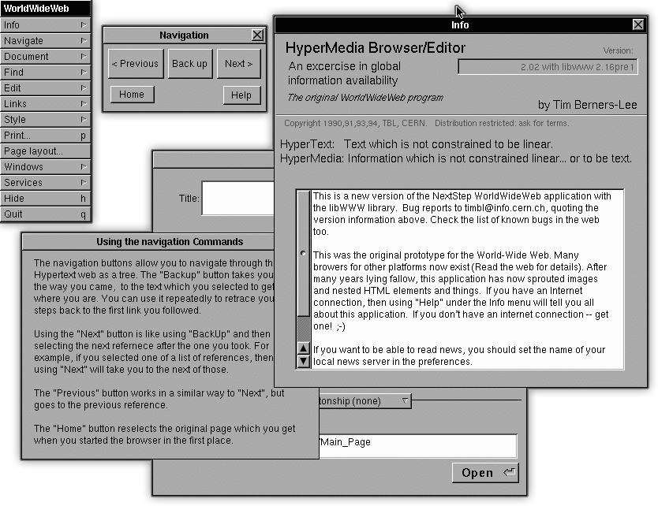
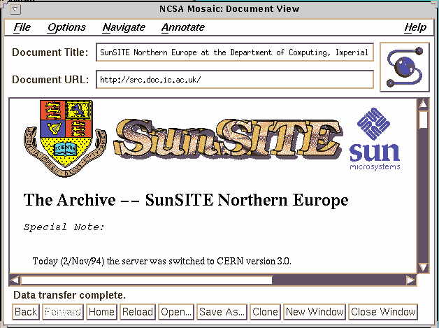
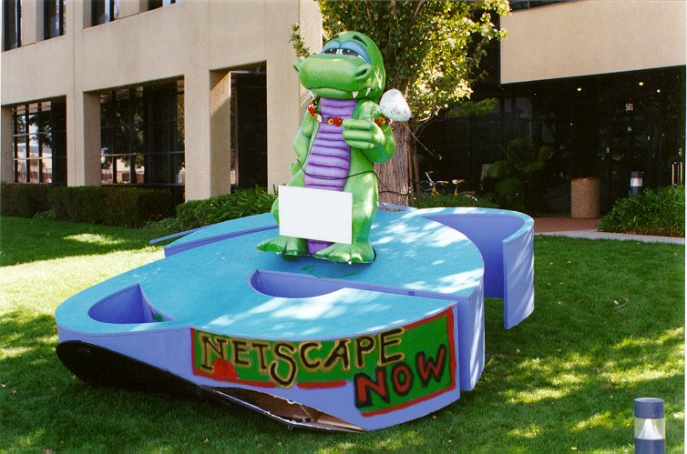
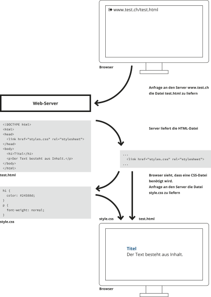

# Technologie · Browser

::: TOC
**Content**
[[TOC]]
:::

## Geschichte der Browser
Einhergehend mit der Entwicklung seines Hypertext-Formates HTML, schuf Tim Berners-Lee ab 1989 am CERN in Genf den ersten Webbrowser (gleichzeitig auch Web-Editor) mit dem Namen WorldWideWeb (später Nexus). Der Browser konnte zwar schon Sprungmarken (Links) und somit Information verknüpfen, jedoch wurden Bilder noch in einem separaten Fenster geöffnet.
Ab 1993 sorgte vor allem der Browser NCSA Mosaic (kurz: Mosaic) für eine weitere Verbreitung diser noch neuen Gattung von Software. Mit Mosaic wurde es möglich, eingebettete Bilder direkt innerhalb des Textes darzustellen und somit Inhalt in sprachlicher Form auch visuell zu unterstützen. Der Browser war auf diversen Betriebsystem – ­MacOS & Windows inklusive – verfügbar und auch auf Unix-Systemen, die in Industrie und Wissenschaft verbreitet waren, wurde die Software durch den grossen Funktionsumfang schnell beliebt.

::: margin compact
#### WorldWideWeb Browser
Erster Browser, jedoch noch ohne eingebetteten Bildern.

Bild-Quelle: https://commons.wikimedia.org/&shy;wiki/File:WorldWideWeb.1.png

:::

::: margin compact

#### Mosaic Browser
Erster Browser, der massentauglich wird und auch Bilder direkt im Text darstellt.

Bild-Quelle: http://www.doc.ic.ac.uk/~lmjm/&shy;WWW_handbook/handbook-3.html
:::

### Browser war
Mitte der 1990er wurde das World Wide Web immer mehr in den Massenmarkt getragen und mit dem Netscape Navigator (anfangs noch Mosaic Netscape) im Jahr 1994 kamen diverse Verbesserungen beim browsen hinzu, die dem kommerziellen Produkt einen schnellen Zulauf gewährten. Als «browser war» wurde der Kampf um Marktanteile mit Netscape's damals grösstem Kontrahenten – dem Internet Explorer (ab 1995) von Microsoft – genannt. Durch den Umstand, dass Microsoft auf jedem Windows-Betriebssystem gleich einen Internet Explorer mit installierte verbreitete sich der neue Browser in kurzer Zeit sehr stark und begann Netscape zu verdrängen. Ab 2009 musste Microsoft nach einem Gerichtsurteil in der EU dann eine freie Browserwahl in Windows integrieren.
Die Rivalität der beiden Browser Internet Explorer (IE) und Netscape Navigator führte dazu, dass beide Hersteller immer neue Technologien einführten um sich vom jeweiligen Konkurenten abzuheben. Einige wichtige Erneuerungen, die bis heute beibehalten und erweitert wurden sind zum Beispiel:

* 1995 – Netscape – JavaScript (damals LiveScript) – Programmiersprache um erweiterte Interaktion zu ermöglichen.
* 1996 – Microsoft – JavaScript (damals JScript)
* 1996 – Microsoft – CSS-Standard 1 wird teilweise unterstützt
* 1999 – Microsoft – Asynchronen Datenübertragung zwischen Browser und Server (AJAX) möglich

::: margin compact

#### Guerilla
In der Nacht vom 1. Oktober 1997 platzierte Microsoft (mutmasslich), nach dem Release von Internet
Explorer 4, ein riesiges Logo vom Internet-Explorer auf Netscapes Firmengelände.

Bild-Quelle: http://home.snafu.de/tilman/&shy;mozilla/stomps.html
:::

 
 
 

### Browser heute
Nach den frühen Wirren und Kämpfen um Browser-Anteile gibt es seit mitte der 2000er-Jahre vorwiegend drei Browser, die sich heute den Markt teilen; Chrome, IE und Firefox. Die Unterschiede im Funktionsumfang sind vor allem für ältere Internet Explorer noch entscheidend, werden jedoch mit neuen Versionen immer kleiner. Zudem sind heutige Browser so genannte «Evergreen Browser» und updaten sich ständig auf die neueste Version.

 

::: margin compact

#### Schweiz
Browser-Statistik
:::

!!!include(./browser/img/CH_browser.svg)!!!

 

!!!include(./browser/browserinfo.md)!!!

::: margin compact

#### Weltweit
Browser-Statistik
:::

!!!include(./browser/img/ALL_browser.svg)!!!

 
Quelle: http://gs.statcounter.com/

## Die Anzeige von HTML – Technischer Ablauf

:::: margin compact small

#### Browser
Webbrowser oder allgemein auch Browser (engl. to browse – stöbern, schmökern, umsehen auch abgrasen) sind spezielle Computerprogramme zur Darstellung von Webseiten im World Wide Web oder allgemein von Dokumenten und Daten.

Quelle:
https://de.wikipedia.org/wiki/Webbrowser
::::

Um eine Website im Browser zu betrachten, laufen folgende Schritte ab:

 

::: grid fullsize

:::

::: margin printonly
#### Autor
Stefan Huber  
sh@signalwerk.ch  
+41 78 744 37 38

#### Dokumentgeschichte
September 2015: Erstellung   
März 2017: Erweiterung

:::

## Weiterführende Informationen

### Browsermarkt & Branche
* https://en.wikipedia.org/wiki/Usage_share_of_web_browsers
* http://2014.report.gridsetapp.com/

### Technische Unterschiede in Browsern
* http://caniuse.com/

### Tim Berners-Lee und die Anfänge des Internets
* https://www.w3.org/People/Berners-Lee/
* http://www.w3.org/People/Berners-Lee/WorldWideWeb.html
