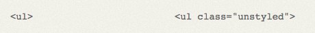

# Gestaltung · Corporate Design

::: TOC
**Content**
[[TOC]]
:::

## Corporate Entwicklung für Websites
Im Gegensatz zu der Entwicklung von analogen Medien ist bei der Umsetzung einer Gestaltung für eine Website die Abgrenzung zwischen den einzelnen Stadien und Aufgaben viel durchlässiger. Technologisch bedingt, ist es nicht zwangsläufig erforderlich, dass ein Arbeitsschritt vom vorhergehenden abhängig ist. So kann zum Beispiel der Programmierer bereits mit dem Kunden die Inhalte aufbauen, obwohl die Gestaltung eventuell gar noch nicht vorhanden ist.

::: grid fullsize space2

:::

### Revisionen
Bei Websites sind die Erneuerungszyklen wesentlich kürzer als bei analogen Medien. Während zum Beispiel bei gedruckten Produkten, von Auflage zu Auflage jeweils viel Zeit vergehen kann oder es gar nur eine Version gibt, wird bei einer Website meist viel häufiger eine neue Revision angestrebt. Dies führt auch dazu, dass der Autor oftmals ohne Zutun des Designers am Produkt arbeitet. Ein Audit von Zeit zu Zeit vom Designer sollte also in regelmässigen Abständen angedacht werden. Auch die Programmierung muss unter Umständen von Zeit zu Zeit auf neue Versionen/Technologien angepasst werden, ohne dass das Design jedoch zwangsläufig ändern muss.

## Eingliederung der Website im Corporate Design

::: margin compact small
#### Definition von Corporate Design
Der Begriff Corporate Design (CD) bzw. Unternehmens-Erscheinungsbild bezeichnet einen Teilbereich der Unternehmens-
Identität (corporate identity) und beinhaltet das gesamte, einheitliche Erscheinungsbild eines Unternehmens.

Quelle: [Corporate Design – Wikipedia](http://de.wikipedia.org/wiki/Corporate_Design)
:::

Das Corporate Identety legt ein Konzept zur Identität der Firma fest. Dieses gibt vor, wie die Unternehmenskommunikation auf strategischer und operativer Ebene geplant werden soll. Darin enthalten ist auch eine visuelle Strategie, wie das Unternehmen nicht nur gegen aussen kommuniziert, sondern wie auch die visuelle Erscheinung davon sein soll. Genau wie jede andere Unternehmenskommunikation und wie jedes andere visuelle Kommunikationsmittel, ist auch die Website individuell auf die jeweilige Eigenschaft des Mediums zu untersuchen und entsprechend zu gestalten.

### Abgrenzung zu anderen Medien
Im Gegensatz zu anderen Meiden ist die Website oftmals ein nicht abgeschlossenes und stetig in Entwicklung befindliches Kommunikationsmittel. Durch die nicht lineare Abfolge und die diversen Formate (Bildschirmgrössen) ergeben sich für den Gestalter Aufgaben, die sich so bei anderen Medien nicht stellen. Eine feste Narration kann nicht geplant werden, da die Website nicht von jedem Benutzer gleich genutzt wird. Die Interaktion mit dem Empfänger sollte dem Medium nicht entzogen, sondern verstärkt werden, da dies ein Alleinstellungsmerkmal einer Website gegenüber anderen Medien darstellt.

::: margin small
#### CD-Manuals für digitale Publikation
Folgende Definitionen solten in einem Style-Guide eines Corporate Manuals minimal vorhanden sein:
* Schriftdefinition (Corporate-Fonts)
* Zeilenabstand & Laufweiten
* Farben
* Formulare & Buttons
:::

### Vom Papier zum Web oder vom Web zum Papier
Häufig werden Corporate Designs von klassischen Agenturen entwickelt, welche ihren Ursprung in der analogen Kommunikation haben. Doch da die Website und die digitale Kommunikation stetig an Bedeutung gewinnt, gibt es je länger je mehr Corporate Designs die zuerst auf der Website beginnen und sich dann auf die anderen Medien adaptieren. Dies hat den Vorteil, dass viele Möglichkeiten und Interaktionen bereits berücksichtigt sind und dann für die analoge Welt lediglich eine Einschränkung berücksichtigt werden können und nicht das Corporate Design weiter ausgebaut werden muss.

 
 
 
 

::: grid fullsize

:::

Beim Corporate Design von Swisscom wurde das Logo
als Animation und Objekt konzipiert.

 

:::: grid
::: w60p

:::
::::

Daraus dann ein statisches Logo zu erstellen ist wesentlich einfacher als
aus dem Logo eine Animation zu machen.

## Living Styleguide
Wie im Print, gehört auch im Web eine saubere Definition für eine durchgehende Einheit der Stile dazu. Diese Dokumentation wird für Websites üblicherweise auch in HTML realisiert und es werden sogenannte «Living Styleguides» definiert. Die Definitionen werden an einem Ort zusammen getragen und dienen dem Designer, wie auch dem Programmierer, die richtigen Stile und Definitionen ab zu rufen.

::::: grid fullsize space2

:::: col_4of12
 

Definition als Beispiel agebildet.

 

Definition als Code agebildet.

::::

:::: col_8of12_last

::::
:::::

Bei einem Living Styleguide (hier das Beispiel von Mozilla) werden alle relevanten Teile eines Auftritts noch einmal abgebildet und gnau aufgelistet, wie diese aussehen.

## Überlegungen beim Corporate Design
Grundsätzlich lässt sich auf dem Web sehr vieles so umsetzen, wie man es auch auf einem analogen Medium machen würde. Es gibt jedoch einige wenige Stolpersteine, welche möglichst früh beachtet werden sollten um allfällige Design-Entscheidungen zu beeinflussen.

### Typografie/Fonts
Die Auswahl der Fonts für eine Website ist nicht immer ganz frei. Es kann sein, dass eine Schrift nicht als Webfont zu lizenzieren ist oder aber dass die Lizenzkosten nicht zu tragen sind. In so einem Fall sollte die Schriftwahl für das ganze Corporate Design überdacht werden.

#### Wichtige Punkte zur Typografie
* Lizenzierung vor Fontwahl klären
* Fonts bei jeglicher digitaler Kommunikation verwenden
* Zeilenabstand als ein Vielfaches der Schriftgrösse definieren
* Laufweiten für verschiedene Schriftgrössen angeben

### Farben
Die Wahl des Farbraums ist auf RGB beschränkt. Die Definition von RGB-Farben sollten wenn möglich im sRGB-Farbraum beschrieben sein, da dieser einen guten Durchschnitt der Fähigkeit von allgemein verfügbaren Bildschirmen darstellt. Die Farbstabilität von Bildschirm zu Bildschirm ist nicht gegeben und wenn möglich sollte dieser Umstand dennoch nicht zu einer starken Farbverschiebung führen. Tertiäre Farben sind also eher zu vermeiden.

#### Wichtige Punkte zu den Farben
* Farben als RGB definieren (sRGB-Farbprofil)
* Farbenkontrast für Farbenblinde (2 – 3% aller Menschen) testen

### Barrierefrei (accessibility)
Da das Internet je länger je mehr auch von Leuten mit Behinderungen und Einschränkungen benutzt wird, empfiehlt es sich, auch mit einem Corporate Design solchen Leuten den Zugang nicht zu erschweren, sondern zu vereinfachen.

::::: grid fullsize space2

:::: col_6of12
:::imageline

:::
Originale Website
::::

:::: col_6of12_last
:::imageline

:::
Test um die Lesbarkeit bei Farbenblinden zu prüfen.
::::
:::::

## Website auf Papier
Zu einem Corporate Design einer Website kann auch gehören, dass sich die Website gestaltet ausdrucken lässt. Diese Anforderung wir heute oft nicht mehr gewünscht, da sich die Leute daran gewohnt haben, dass der Ausdruck nicht immer Ideal ist. Aber technisch lässt sich die Darstellung auch da steuern und man kann diverse Optimierungen für einen solchen Ausdruck machen. Oft müssen folgende Dinge für ein optimiertes Ergebnis beachtet werden:

* Navigations-Elemente, die auf dem Ausdruck keinen Sinn ergeben, können ausgeblendet werden
* Bilder und Logos die eine Hintergrundfarbe aufweisen, die dann aber auf weissem Papier falsch aussehen wirken falsch
* Links, welche im Ausdruck keinen Sinn mehr ergeben sollten mit Adresse im Ausdruck ersichtlich sein.

::::: grid fullsize space2

:::: col_4of12
 

::: imageline

:::
 

Kopfbereich mit Adresse und Logo wurde eingeblendet, Navitation entfernt und selbst der Text, welcher auf der Seite nur über einen weiteren Klick erreichbar ist, wird ausgedruckt.

::::

:::: col_8of12_last

<!-- Website in der normalen Ansicht -->

Quelle: [R&G Metallbau AG](http://www.rg-metallbau.ch/) (Version 2008 nicht mehr online)

::::
:::::

::: margin printonly
#### Autor
Stefan Huber  
sh@signalwerk.ch  
+41 78 744 37 38

#### Dokumentgeschichte
Juni 2014: Erstellung  
November 2015: Ergänzung  
März 2017: Erweiterung

:::

## Weiterführende Informationen

### Software-Management
* [Prinzipien hinter dem Agilen Manifest](http://www.agilemanifesto.org/iso/de/principles.html)
* [Pflichtenheft – Wikipedia](https://de.wikipedia.org/wiki/Pflichtenheft)
* [Lastenheft – Wikipedia](https://de.wikipedia.org/wiki/Lastenheft)

### Styleguides (Beispiele)
* [Mozilla Style Guide — Mozilla](http://www.mozilla.org/en-US/styleguide/)
* [Lightning Design System](https://www.lightningdesignsystem.com/)
* [BBC GEL | Foundations](http://www.bbc.co.uk/gel/guidelines/category/foundations)
* [Facebook Brand Resources](https://www.facebookbrand.com/)
* [Corporate Design – Services & Ressourcen | ETH Zürich](https://www.ethz.ch/services/de/service/kommunikation/corporate-design.html)

### Print & CSS
* [CSS Design: Going to Print](http://alistapart.com/article/goingtoprint/)
* [Referenzen - R&G Metallbau AG](https://web.archive.org/web/20080618200258/http://www.rg-metallbau.ch/referenzen-n6-i387-p1-sD.html) (Beispiel)

### Farbwahl/Farbenblind
* [ColorBrewer: Color Advice for Maps](http://colorbrewer2.org/)
* [Colour Contrast Check](http://www.snook.ca/technical/colour_contrast/colour.html)
* [Finding the Right Color Palettes for Data Visualizations](https://medium.com/graphiq-engineering/finding-the-right-color-palettes-for-data-visualizations-fcd4e707a283)
