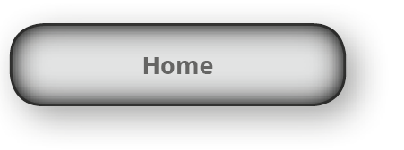
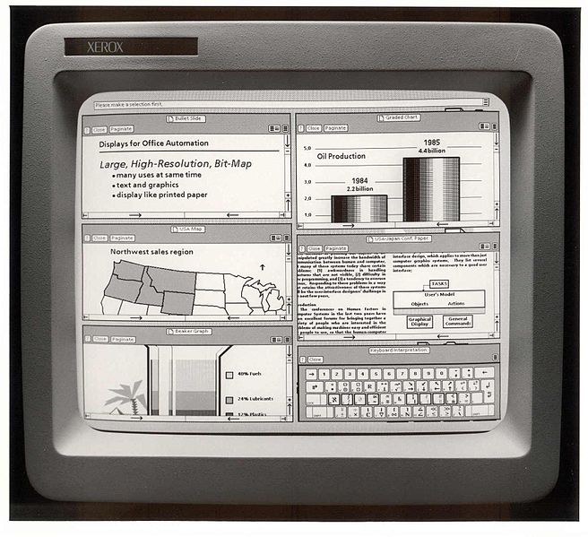
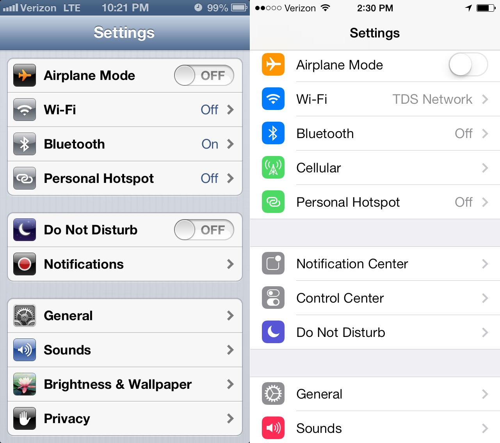
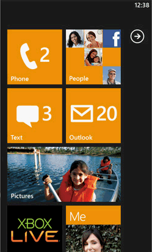

# Gestaltung · Design-Paradigmen

::: TOC
**Content**
[[TOC]]
:::

## Skeuomorphismus
::: margin compact

Beispiel: Die Schalfläche auf dem Bildschirm immitiert die Form eines realen Knopfes nach.
:::
Der Begriff Skeuomorphismus ist aus den beiden altgriechischen Worten für Behälter/Werkzeug und Gestalt zusammengesetzt. Es wird hiermit eine Stilrichtung im Interfacedesign bezeichnet, die sich an gegenständlichen Objekten aus der analogen Welt orientiert. Die Analogie soll dem Benutzer helfen, sich schneller zurecht zu finden und die Abstraktion eines Interfaces soll möglichst klein gehalten werden.

### Ursprünge
Im Jahr 1973 wurde mit «Xerox Alto» der erste Personal Computer vorgestellt, der eine grafische Benutzeroberfläche hatte, die eine Metapher zum Schreibtisch hatte. Die Forscher am Xerox Palo Alto Research Center (PARC) vereinten ein GUI (Graphical User Interface) mit der Bedienung der Maus und suchten dafür ein visuelles System, welches dem Benutzer vertraut ist. Sowohl das aussehen, wie auch die Benennung der einzelnen Teile wurden sehr stark an die reale Welt angepasst. So gab es mit dem neuen Konzept plötzlich Ordner, Fenster, Schreibtische. Im Jahr 1977 folgte mit Apple II (Apple I – 1976) ein Produkt, welches dieses Prinzip auch in grösseren Stückzahlen zu den Heimanwendern brachte.

::::: grid fullsize space2
:::: col_6of12

### Desktop
Die Analogie zum Schreibtisch setzte sowohl die Namensgebung, wie auch die Gestalt.

Bildquelle: [Xerox Star 8010 - Wikipedia](https://en.wikipedia.org/wiki/File:Xerox_Star_8010_workstations.jpg)
::::
:::: col_6of12_last

### GUI & WYSIWYG
Mit der Programmiersprache Smalltalk wurden im Jahr 1980 sowohl Weichen für die Programmierung (MVC-
Pattern), wie auch für das Benutzerinterface gestellt.
Das Konzept von GUI (Graphical User Interface ) und What You See Is What You Get (WYSIWYG) wurde in die Breite getragen.

Bildquelle:
[PARC – Media Library](https://www.parc.com/newsroom/media-library.html)
::::
:::::

## Flat Design
::: margin

Beispiel: Die Schaltfläche verliert die Anlehnung an den Knopf und wird zur Fläche.
:::
Funktionales und reduziertes Design gibt es schon länger. Sei es nun das Bauhaus in den 1920er-Jahren oder Schweizer Typografie (Swiss Style) in den 1950er-Jahren. Die Idee der klaren Form und des stark strukturierten Aufbaus von Inhalt – oft auch unter Zuhilfenahme von Raster-Systemen – steht dabei im Zentrum.

### Mobile Geräte
Mit dem so genannten «Flat Design» wurden im Interface-Design die Elemente von 3D-Effekten befreit und die Reduktion auf klare Formen ohne Verläufe, ohne Abrundungen und ohne Schatten wurde voran getrieben. Die erste grosse Welle von Flat-Design kam mit dem Mobile-Betriebsystem «Microsoft Windows Phone 7» im Jahre 2010.
Im Jahre 2013 wurde mit der veröffentlichung von iOS 7 auch für mobile Geräte von Apple das Flat-Design durchgehend eingeführt. Die Sehgewohnheiten der User haben sich seit dem stark an die neuen Flat-Designs angepasst und es kommen bei neuen Apps und Websites fast ausschliesslich Flat-Designs zum Einsatz.

::::: grid fullsize space2
:::: col_8of12
::: imageline

:::
### iOS 7
Beim Wechsel von iOS 6 zu iOS 7 wurden 3D-Effekte verworfen und eine klare
Farbpalette eingeführt.
::::
:::: col_4of12_last
::: upscale

:::

### Windows Phone 7
Das User-Interface ab Windows Phone 7 wurde mit Kacheln und flachen Designs eingeführt.
::::
:::::

## Material Design

::: margin

Beispiel: Die Schaltfläche liegt wie eine Papier-Fläche auf einer anderen Fläche.
:::
Google kündigte auf Ihrer Entwicklerkonferenz «Google I/O» im Jahr 2014 das Android 5 (Betriebssystem) an und integrierten darin das so genannte «Material Design». Die Idee basiert in der Grundlage auf einem minimalistischen Flat Design, welches jedoch stark auf Animation, Übergänge (Transitions) und einer Tiefen-Ebene fokussiert. Die Flächen wirken wie aufeinander gestapelt und leicht dreidimensional.
Ab 2015 ist dieses Designprinzip durchgehend auf alle Google-­Produkten angewendet. Besonders auf Android-Geräten werden Applikationen in Material-Design gestaltet. Auch Web-Seiten übernehmen immer öffters diese Designprizipien.

 
 

::: grid w70p imageline

:::

 

Klare Typografie, leicht abgehobene Aktionsflächen und reduzierte Icons sind Merkmale von Material Design.

Bildquelle:
[Android Material Design - Freebiesbug](http://freebiesbug.com/psd-freebies/android-material-design/)

::: margin printonly
#### Autor
Stefan Huber  
sh@signalwerk.ch  
+41 78 744 37 38

#### Dokumentgeschichte
September 2015: Erstellung  
März 2017: Erweiterung
:::

## Weiterführende Informationen

### Geschichte vom GUI
* [History of Icons](https://historyoficons.com/)

### Flat Design
* [Apple – iOS Human Interface Guidelines](https://developer.apple.com/ios/human-interface-guidelines/overview/design-principles/)
* [Intacto 2013 FLAT DESIGN vs REALISM](http://www.flatvsrealism.com/)

### Material Deisgn
* [Material design - YouTube](https://youtu.be/Q8TXgCzxEnw)
* [google - Material design guidelines](https://www.google.com/design/spec/material-design/)
* [Material Design Resources and Tutorials — SitePoint](http://www.sitepoint.com/10-essential-material-design-resources-and-tutorials/)
* [Materialize CSS Library](http://materializecss.com/)
