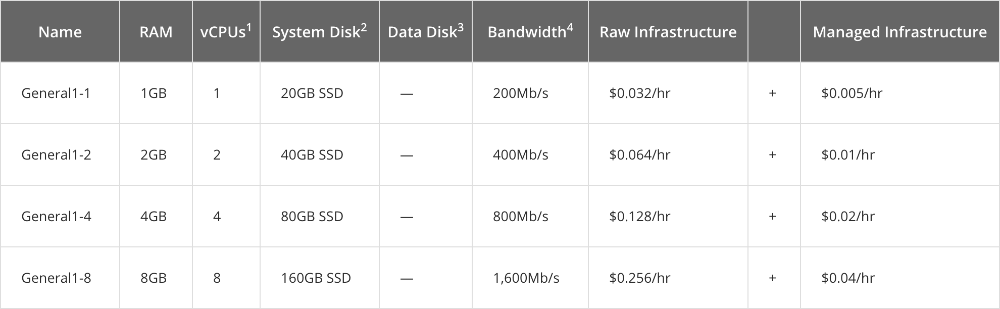

# Gestaltung ·  Einbinden von externen Inhalten

::: TOC
**Content**
[[TOC]]
:::

## Inhalte einbinden oder verlinken
Eine der Grundideen des World Wide Webs ist das Verknüpfen von Inhalten. Die Verbindung der verschiedenen Inhalte oder Inhaltsebenen verläuft oft über eine konventionelle Verlinkung auf eine externe Seite. Dies muss jedoch nicht zwangsläufig so sein, sondern man kann auch fremde oder externe Inhalte live in seine Website einbinden lassen. Das hat den Vorteil, dass Inhalte durch die externe Quelle auch aktualisiert werden können, ohne dass die Site, in der die externen Inhalte zusammen gezogen werden, aktualisiert werden muss.

### Hotlinks
Technisch ist ein sogenanntes hotlinking (inline linking) die wohl einfachste Form um externe Inhalte einzubinden. Man stellt in seiner Seite anstatt Bilder vom eigenenen Server, solche von Webservern dritter dar. Rechtlich betrachtet kopiert man also nicht allfällig urheberrechtlich geschütztes Material, sondern bindet die Originaldatei lediglich in seiner Site ein. Aus rechtlicher Sicht ist dies meist unbedenklich, sollte aber wo möglich – und vom Urheber nicht ausdrücklich so gewünscht – wohl eher vermieden werden. Der Urheber kann sich auch gegen diese Praxis wehren, indem er prüft, von welcher Seite das Bild erfragt wird (http referer) und wenn die Anfrage nicht von der eigenen Seite komm, die Auslieferung der Daten verweigert.

 
 
 

::::: grid

:::::

::::: grid
:::: col_6of12
### Bilder vom Website-Betreiber
Bei den meisten Websites kommen die Seite und die
Bilder vom selben Server/Anbieter.
::::
:::: col_6of12_last

### Bilder von externem Server (Hotlinks)
Technisch gesehen, spielt es keine Rolle von welchem Server die Bilder kommen. Rechtlich ist auch das Hotlinking in der Schweiz grundsätzlich erlaubt, jedoch sollte dies eher vermieden werden um allfällige Streitigkeiten zu vermeiden.
::::
:::::

## Komponenten, Feeds und APIs
Für diverse Dienste und und Informationen stehen Datenquellen zur Verfügung, die dann mittels HTML-Seite (iframe) oder JavaScript angezeigt werden können. So gibt es Videoportale, Social Media Dienste, Wetterinformationen, Abfahrtpläne (ÖV) und vieles mehr, was als Datenquelle angeboten wird und dann im Browser angezeigt werden kann. Gewisse API-Schnittstellen können nur mit speziellen Zugangsschlüsseln (so genannte Tokens) abgefragt werden.

### Komponenten (Widgets)
:::: margin compact
::: imageline

:::
### Beispiel Social Media
Twitter bietet die Möglichkeit, sogenannte «Twitter-Cards» einzubinden.
::::
Unter Widgets versteht man meist Inofrmationen, die spezifische Daten von Drittanbietern anzeigen. Dies sind meist abgeschlossene und kleine Blöcke, die aktuelle Meldungen (Social Media), Videos, News oder ähnliches zeigen. Dabei handelt es sich nicht nur um Daten, sondern oft um fertig gestaltete Blöcke, die eingebaut werden können. Komponenten wurden früher immer mit iframes (HTML-Element) gemacht, heute mehr und mehr mit JavaScript eingebunden.

 

### Feed
::::: margin compact
:::: grid
::: imageline

:::
::::
### RSS-Feed
Eine News-Portal kann die Anreisser zum Beispiel als RSS-Feed veröffentlichen.
:::::
Unter Feeds versteht man meiste eine URL (Datei), deren Inhalt dann neu erzeugt wird, wenn ein weiteres Element hinzu gekommen ist. Dies wird vor allem für News-Portale (Zeitungen, Blogs, ...) angeboten. Dabei wird eine RSS (Rich Site Summary) vom Site-Betreiber in Form einer XML-Datei angeboten. Eine externe Website (oder andere News-Clients) können dann in periodischen Abständen nach einer neuen Datei fragen und erhalten dann die aktualisierten Inhalte.

 

### API-Inhalte
Über API (application programming interface) werden im Internet Dienste eingebunden, die meist nicht nur eine fertig vorgefertigte Datei ausliefern, sondern die durch gezielte Anfragen ein gewünschtes Resultat zurück liefern. Dies können zum Beispiel Wetterinfos, Suchresultate oder ähnliches sein. Über API-Schnittstellen können auch Daten auf einen externen Server geschrieben werden.

## Technik der Inlineframess (iframe)
Technisch funktionieren viele externe Komponenten (Elemente) so, das die fremden Inhalte vom Server des Anbieters eingebunden werden. Dies geschieht oft über iframes. Ein Inlineframe (iframe) ist ein Element in einer Website, welches wiederum eine vollständige HTML-Site enthält (transkludiert). Es ist also wie ein separat abgeschlossener Container in einer Website. Das iframe ist vollständig eigenständig und könnte auch als einzelne Website betrachtet werden, obwohl darin meist nur kleinere Teile enthalten sind (also beispielsweise ein Facebook-Button). Wie die iframes in die Website eingefügt werden ist nicht immer gleich. Zum Teil wird gleich das iframe in die HTML-Datei eingefügt, zum Teil sind es kleine JavaScript-Befehle, die dann an der gegebenen Stelle ein iframe erstellt.
Technisch kann man externe Inhalte auch ohne iframes einbinden, dies ist jedoch oft die einfachste Lösung, da dann die Website und die externen Inhalte klar getrennt sind und sich gegenseitig nicht beeinflussen. Wenn nur Daten von einem externen Anbieter bezogen werden, also zum Beispiel API-Schnittstellen oder Feeds, dann erfolgt die Darstellung meist ohne iframes, sondern direkt in der Website, ohne dem abschottenden Container des iframes.

 
 
 

::: margin compact
Ein iframe ist eine vollständige HTML-Seite in einer vollständigen HTML-Seite.
:::
 
 

::: grid

:::

## Social Media Buttons
:::: margin compact
::: grid w60p upscale

:::
### Buttons der Anbieter
Social Media Buttons, die direkt von den Plattformen ausgeliefert werden haben auch einen Counter über bereits erfolgte Shares.
::::

Eine sehr weit verbreitete Möglichkeit, fremde Inhalte in die eigene Site ein zu binden sind so genannte Social Media Buttons. Diese haben den Zweck, die aktuelle (eigene) Seite auf einer Social Media Plattform zu teilen. Das heisst, dass es sowohl eine Verlinkung zu einer anderen Seite gibt, wie auch das visuelle Feedback, wieviel andere Personen die entsprechende Seite schon geteilt oder favorisiert (likes) haben. Die grösseren Social Media Plattformen bieten im allgemeinen einen Konfigurator um die Buttons zu formatieren und steuern. Der so erzeugte Code kann dann in die eigene Seite eingefügt werden.

 

### Datenschutz (Privacy)
:::: margin compact
::: grid w60p upscale

:::
### Aktivieren bei bedarf
Gewisse Sites ermöglichen ein «einschalten» von Buttons, wenn dies benötigt/gewünscht werden.
::::
Da die Buttons inhalte von externen Quellen (der Plattform) beziehen, kann die Plattform dadurch auch verfolgen (tracken), welche Website von wie vielen Personen besucht wird. Zudem kann, wenn der Besucher bei der Plattform angemeldet ist, das Surfverhalten der jeweiligen Person der Plattform genauer untersucht werden. Dieses Verhalten sind sich die Besucher einer Website meist gewohnt und es wird im allgemeinen kein Anstoss daran genommen. Bei sensiblen Daten oder wenn man seinen Seitenbesucher schützen möchte, so kann man die Social Media Buttons auch so gestallten, dass die erst auf Wunsch des Benutzers (nach zusätzlichem Klick) geladen werden und somit nur bei bewusster Handlung ein Tracking erlauben.

 

### Zähler vom Server
:::: margin compact
::: grid w70p upscale

:::
::::
Auch kann der Server die Zahlen bei den Sozialen Netzwerken
abfragen und dann dem Besucher vom eigenen Server übermitteln.
So bleibt der Besucher gegenüber dem Netzwerk geschützt.

 

## Video
::: margin compact
### Marktanteile
Obwohl YouTube und Vimeo etwa die selben Funktionen bieten, ist YouTube doch etwa 150× grösser als vimeo.
YouTube dominiert den Markt klar.
:::
Videos werden bei professionellen Video-Portalen als sogenannte Streams ausgeliefert. Dies hat den Vorteil, dass sowohl die Bandbreite entsprechend der Güte der Verbindung (Geschwindigkeit) angepasst wird, wie auch die Abspielposition frei angesprungen werden kann (Vorspulen). Diese Möglichkeiten sind bei einer selbst gehosteten Video-Datei keine Selbstverständlichkeit. Meist liegt dann das Video nur in einer Version auf dem Server vor und ist somit nur für genau eine Bandbreite optimiert, die jedoch nicht zwingend zum Client passen muss. Dazu kommt, dass das Video vom eigenen Server meist als ganze Datei zum Browser übertragen wird, was zur Folge hat, dass nur an Positionen gesprungen werden kann, die schon vollständig geladen sind. Ein beliebiges vorspringen ist somit nicht gegeben, was den User unter umständen irritiert.

::::: grid fullsize
:::: col_4of12
### vimeo
Bei vimeo gibt es eher eine kleine und feine Community.
Viele Inhalte sind originär und qualitativ hochwertig.
::::
:::: col_8of12_last
### YouTube
Bei YouTube kann man alle Arten von Videos finden. Es wird ein breiter
Massenmarkt angesprochen.

::::
:::::

 

::::: grid fullsize
:::: col_4of12
::: imageline

:::

::::
:::: col_8of12_last
::: imageline

:::
::::
:::::

 

::: margin compact
### Kommentarkultur
Auf YouTube gibt es zum Teil eine
eher bedenkliche Kommentarkultur mit beleidigungen und unpassenden
Äusserungen. Dies kann je nach Video und Kontext unerwünscht sein.

:::

::: grid w60p

:::

## Karten (maps)
::: margin compact

### Geo-Daten
Die meisten Karten-Services ermöglichen das Anreichern des Kartenmaterials mit zusätzlichen Daten.
:::
Karten sind ein häufiger Anwendungsfall in dem man sich auf einen externen Service verlässt. Die Landkarte wird in vielen kleinen Teilbildern an den Browser übermittelt und dann im Browser wieder zusammen gesetzt. Dies ist technisch aufwändig und die Bilder benötigen für die ganze Welt sehr viel Speicherplatz. Auch wird es immer wieder Veränderungen geben, die ein update des Kartenmaterials erforderlich machen. Um diese Probleme zu umgehen, gibt es diverse Anbieter von Karten-Diensten. Diese ermöglichen dann meist auch über zusätzliche Schnittstellen das einbinden von zusätzlichen Informationen auf den Karten, die vom Benutzer definiert werden können. Wird ein speziefisches Design oder eine Corporate-Farbgebung benötigt, können die Karten auch mit speziellen Programmen und den aktuellsten Daten von OpenStreetMap erzeugt werden und dann auf dem eigenen Server gehostet werden. Dies ist meist jedoch eine Ausnahme.

### Style
Werden spezielle Corporate-Farben oder
ein spezieller Stil benötigt, kann dies mit Drittanbietern realisiert werden.

 

 

## Einbinden statt zahlen
Ein Anbieter von Servern bezahlt nebst der effektiven Hardware und dem Stromverbrauch vor allem für das Datenvolumen, das von einem Webserver übertragen wird. Dieser Server-Anbieter kann entweder mit dem Site-Betreiber eine Vereinbarung haben, dass ein gewisses Datenvolumen pro Zeiteinheit frei ist (eventuell sogar unbeschränkt) oder der Serverbetreiber verrechnet der Website den effektiven Verbrauch. Wenn nun also externe Inhalte eingebunden werden, die nicht über den Server des Websitebetreibers laufen, entstehen dem Betreiber Minderkosten. Umgekehrt entstehen dafür beim Serverbetreiber, auf dem die externen Inhalte gespeichert sind, Mehrkosten durch den erhöhten Datenverkehr. Dies kann vor allem bei grossen Dateien, wie zum Beispiel bei Videos, ein nicht unerheblicher Kostenfaktor sein.
Bei kleinen Sites, die wenige hundert Zugriffe pro Tag haben, ist die Bandbreite meist kein Thema und auch kein Kostenfaktor.

 
 
 

::::: grid fullsize
:::: col_4of12

[Preise amazon](https://aws.amazon.com/rds/pricing/)

::::
:::: col_8of12_last

[Preise rackspace](https://www.rackspace.com/cloud/servers)

::::
:::::

::::: grid fullsize
:::: col_4of12
### Bandbreite nach Volumen
Es gibt gewisse Anbieter, die verrechnen den Traffic aufgrund des Volumens.
::::
:::: col_8of12_last

### Bandbreitenbeschränkung
Andere Anbieter bieten Server mit einer maximalen Bandbreite an, die dann ausgenutzt werden
kann ohne Mehrkosten zu erzeugen
Preisbeispiel: rackspace.com

::::
:::::

 
 
 

::: margin compact
Bildquelle: [levels.io](https://levels.io/hacker-news-number-one/)
:::

### Unvorhergesehenes
Wird eine Website auf einem bekannten Portal hervorgehoben, oder auch
in einem anderen Massenmedium gezeigt, so kann es vorkommen,
dass der Datendurchsatz plötzlich ansteigt und Kosten verursacht werden.

::: margin printonly
#### Autor
Stefan Huber  
sh@signalwerk.ch  
+41 78 744 37 38

#### Dokumentgeschichte
Oktober 2015: Erstellung    
Mai 2017: Erweiterung

:::

## Weiterführende Informationen

### Hotlinks
* [What is Hotlinking?](http://altlab.com/hotlinking.html)
* [Prevent hotlinking of images](http://www.htaccesstools.com/hotlink-protection/)

### Privacy
* [EU Gesetz für cookies](http://ec.europa.eu/ipg/basics/legal/cookies/index_en.htm)
* [Sichere Social Media Buttons](http://panzi.github.io/SocialSharePrivacy/)
* [Sichere Social Media Buttons auf Server](https://github.com/heiseonline/shariff)

### Social Media Buttons
* [Twitter Publish](https://about.twitter.com/resources/buttons)
* [Facebook Buttons](https://developers.facebook.com/docs/plugins/like-button)

### Karten
* [OpenStreetMap](https://www.openstreetmap.org/)
* [Google Maps](https://www.google.ch/maps)
* [Leaflet – Maps und daten](http://leafletjs.com/)
* [Karten mit diversen Stilen](https://www.mapbox.com/guides/getting-started-studio/)
* [Kartenstile selber erstellen](https://www.mapbox.com/tilemill/)

### API & Streams
* [RSS – Wikipedia](https://de.wikipedia.org/wiki/RSS_(Web-Feed))
* [Transport API](http://transport.opendata.ch/)
