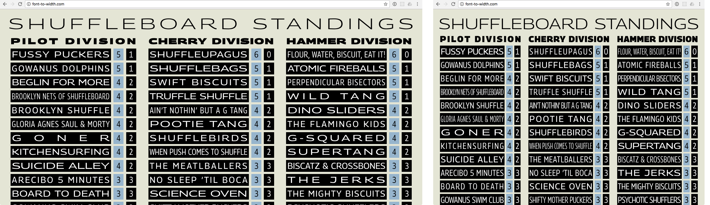
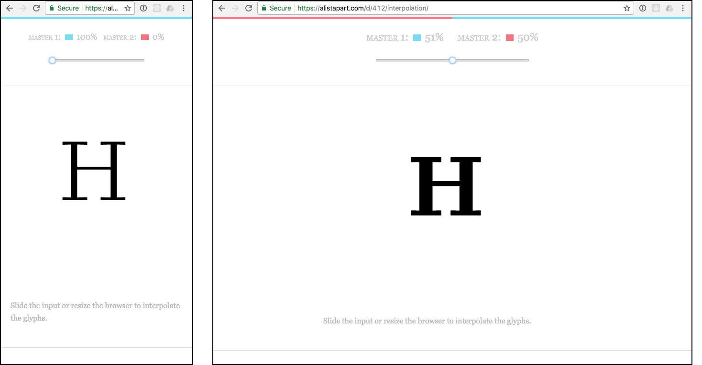

# Gestaltung · Fonts

::: TOC
**Content**
[[TOC]]
:::

## Fonts finden & testen
::: margin compact
#### Mieten von Desktop-Fonts
Auf fontstand.com können Desktop-Fonts gemietet werden. Dies ermöglicht Entwürfe dem Kunden vor zu legen, ohne den Font gekauft zu haben.
:::
Fonts für Web- und Screendesign können von fast allen grossen und kleinen Font-Foundrys erworben werden. Es gibt vereinzelt Schriften, die (noch) nicht für den Web-Einsatz lizenziert werden können, dies ist jedoch eher die Ausnahme. Für Anwendungen ausserhalb des Webs – aber auf Screens – gibt es relativ wenige Anbieter. So bietet zum Beispiel Linotype auch für eBooks, Apps und Server-Anwendungen Lizenzen, diese Lizenztypen sind jedoch bei anderen Firmen oft nur mit Verhandlungen zu erwerben und es gibt keine standardisierten Prozesse.
Das Vorgehen zur Recherche von neuen Schriften unterscheidet sich nicht wesentlich vom finden von Schriften für den Print-Bereich. Sucht man eine Schrift, deren Name schon bekannt ist, so kann direkt zum Anbieter gesprungen werden. Ist man eher auf der Suche nach einem bestimmten Stil, kann eine Font-Plattform wie myfonts.com genutzt werden um ein entsprechendes Design zu finden.

### Testen
Beim Suchen von Schriften ist es ratsam, die Schrift möglichst in einem Live-Preview auf die Tauglichkeit am Bildschirm zu prüfen. Deshalb können Fonts bei immer mehr Anbietern entweder auf der Seite getestet werden, oder aber Sie kooperieren mit Test-Platformen wie zum Beispiel typecast.com. Bei solch einem Dienst kann bereits vor dem Kauf geprüft werden, ob die Schrift bei gewünschter Anwendung, Grösse und Schriftmischung auf dem Screen funktioniert.

 
 

::: margin
### Vor dem Kauf testen
Auf typecast.com können Text-Layouts bereits vor dem Kauf einer Schrift definiert und editiert werden.
Dies erleichtert die Wahl eines geeigneten Fonts und zudem kann dem Kunden bereits ein Eindruck der fertigen Site vermittelt werden.
:::

::: imageline

:::

## Fontlizenzen
::: margin compact
#### Mieten pro Monat
* typekit.com
* fonts.com

#### Fonts einmalig kaufen
* urwpp.de

#### Views kaufen
* linotype.com
* fontshop.com
:::
Es gibt grundsätzlich drei verschiedene Arten von kommerziellen Font-Lizenzen:

### Zeichensatz
Wird die Schrift auf einer Seite eingesetzt, bei der viele Sprachen oder sonst spezielle Zeichen vorkommen, so ist es empfehlenswert zu Prüfen, ob die Schrift auch den nötigen Zeichensatz abdeckt. Auch OpenType-Features werden von den Schriftherstellern normalerweise vor dem Kauf angegeben.

### Miet-Lizenzen
Beim mieten von Lizenzen wird meist ein ein View-Volumen pro Monat gekauft unabhängig jedoch von der Anzahl der Fonts. So kann zum Beispiel bei fonts.com ein Account erworben werden, der 50 000 Pageviews pro Monat auf einer Domain erlaubt. Wird diese Zahl überschritten, muss auf ein höherer Preisplan gewechselt werden. Oft kann ein Account für diverse Projekte gleichzeitig verwendet werden. Die Fonts sind beim Anbieter gehostet.

### Kaufen von Lizenzen
Bei relativ wenigen Anbietern kann auch eine Lizenz erworben werden, die auf dem eigenen Web-Server installiert werden kann. Die Schrift wird auf dem eigenen Server installiert und der Schriftenanbieter vertraut darauf, dass der Käufer die Anzahl Views, für die Lizenziert wurde, nicht überschritten wird.

### Kaufen von Views
Es gibt Anbieter, die Views verkaufen. Das heisst, dass mit jedem Besuch einer Webseite mit dem Font das erworbene «Konto» um ein View reduziert wird. Somit muss die Schrift von Zeit zu Zeit wieder mit neuen Views aktiviert werden, so dass immer genügend Views vorhanden sind. Oder aber das Konto erneuert sich immer am Ende des Monats neu.

## Freefonts – Kommerzielle Fonts
Es gibt von diversen Font Foundries, Firmen und Enthusiasten qualitativ sehr hochwertige und gute Schriften, die frei verfügbar sind. Dabei gibt es diverse Abstufungen. Es gibt ganze Schriftfamilien, die frei sind, dann gibt es Schriftfamilien, bei denen einzelne Schnitte frei sind, oder es gibt Fonts, bei denen ein gewisser Zeichenumfang frei ist. Damit nicht bei den einzelnen Stellen im Web nach den Fonts gesucht werden muss, empfiehlt es sich, Portale zu verwenden, die einem die verschiedenen Fonts sortiert präsentieren oder eine schnelle Suche ermöglichen. Auch bieten solche Portale zum Teil die Möglichkeit, die Fonts gleich von deren Server zu laden (google Fonts) oder gewisse Konvertierungen für den Webgebrauch (fontsquirrel) zu erledigen.
Die benötige Fontlizenz für eine Website sollte mit dem Kunden geklärt werden und bereits in der Offerte sollte geklärt sein, wer die Lizenz zu erwerben hat.

### Kunde oder Agentur
Aus finanzieller Überlegung kann es attraktiv sein, die Schriftlizenzen für alle Kunden über ein Konto der Agentur zu kaufen. So können die Kosten auf die verschiedenen Webprojekte umgelegt werden. Dies hat jedoch auch den Nachteil, dass die Agentur die Verantwortung gegenüber dem Kunden hat, den Account zu bezahlen und pflegen.

 
 
 

::: margin
#### fonts.com
Im nebenstehenden Beispiel sieht man, dass für $32 pro Monat eine Million Views für beliebig viele Domains erworben werden kann.
::::

## Iconfonts
Icons werden auf Websites oft verwendet um Inhalte schneller und einfacher zugänglich zu machen. Aus technischer Sicht ist es relativ einfach – für einen Programmierer – diese Icons aus einem Font zu machen. Zudem haben solche Icons den Vorteil, dass Sie auf vielen Betriebsystemen und Browsern funktionieren und vektorbasiert aufgebaut sind. Als Nachteil ist zu beklagen, dass für die Accessibility (Menschen mit Behinderung einen Zugang ermöglichen) es oftmals keine gute Idee ist, die Icons mit Schrift zu machen, da die Zeichen dann als Inhalt verstanden werden und zum Beispiel Screen-Reader damit Probleme haben können.

 
 

::: margin
### Iconfonts optimieren
Fontello.com bietet die Möglichkeit aus diversen freien Icon-Fonts sich die nötigen Icons zu suchen und dann einen eignenen Icon-Font daraus zu erstellen.
:::

::: imageline

:::

## Font-Konzepte fürs Web
### Responsive Grösse
Fonts können auf die grösse des Geräts oder die grösse des Fensters reagieren. So können zum Beispiel Schriftgrössen abhängig von der Fenstergrösse (Viewport) definiert werden. Oder aber wenn das Layout von einer zweispaltigen Darstellung in eine einspaltige Darstellung wechselt (bei mobilen Geräten), kann eine ander Schriftgrösse gewählt werden.

 

::: grid fullsize

Mit CSS ist es möglich je nach Fensterbreite die Schrift in der Grösse anzupassen.
:::
 

### Font abhängig von Fenstergrösse
Bei diesem noch eher neuen Konzept ist die Idee, dass sich nicht nur die Grösse des Fonts dem Fenster anpasst, sondern dass auch der Font selber dem Fenster oder der Bildschirmgrösse angepasst wird. Diese Technologie ist heute schon möglich.

 

::: grid fullsize

Fontwechsel – Auswechseln von Fonts abhängig von der Fenstergrösse.
:::

## Variable Fonts
Im Oktober 2016 hat ein breites Konsortium von diversen Herstellern den OpenType Standard mit der Version 1.8 angekündigt. Adobe, Google, Microsoft und Andere haben angekündigt diesen Standard bald in Ihre Software-Produkte zu integireren. Neben diversen eher technischen Erneuerungen ist vor allem die Möglichkeit für «Variable Fonts» für Gestalter heraus zu streichen. Mit dieser Funktion können Fonts mehrere so genannte Design-Achsen haben. Man kann also Fonts so einrichten, dass Sie zum Beispiel von ganz Light zu super Black stuffenlos (oder mit vom Designer gewählten Stufen) einstellbar sind. Aber auch andere Design-Achsen lassen sich frei vom Schriftdesinger bestimmen. Diese Technologie erinnert an die «Multiple master fonts» (1991), jedoch wird sich der neue Standard wohl besser verbreiten als die damalige Technologie.

### CSS und Web
Im Moment werden Variable Fonts gerade in die Software-Produkte eingebaut. Erste Test-Versionen sind für Entwickler zugägnlich. Folgende CSS-Attribute sind vom Standard vorgesehen:

* `font-weight` – Schriftstärke als Zahl von 1–999
* `font-stretch` – Schriftbreite in % (50% = Condesed, 200% Extended)
* `font-style` – Schriftlage zwischen -90° und +90°
* `font-optical-sizing` – Optische Schriftgrösen ein- oder ausschalten

 
 

Daneben lassen sich aber auch weitere Werte-Achsen wie folgt definieren

::: code
<pre>
p {
    font-variation-settings: "wdth" 600, "wght" 200, "opsz" 48;
}
</pre>
:::
Hier wird jeweils eine Werte-Achse mit vier Buchstaben (vom Designer bestimmt) mit einem Wert angewandt.

### Vorläufer
Bevor OpenType 1.8 erschien, hatten bereits einige Programmierer einen ähnlichen Effekt mittels JavaScript erziehlt. Dies waren aber eher Experimente, denn wirklich im realen Einsatz.

 
 

::: grid fullsize

Fontinterpolation – Anpassen des Fonts je nach Fenstergrösse.

Bildquelle: http://alistapart.com/d/412/interpolation/
:::

::: margin printonly
#### Autor
Stefan Huber  
sh@signalwerk.ch  
+41 78 744 37 38

#### Dokumentgeschichte
September 2015: Erstellung  
März 2017: Erweiterung
:::

## Weiterführende Informationen

### Schriften Testsen
* http://typecast.com (über https://www.google.com/fonts/ auch ohne Account)

### Schriften erwerben
* https://www.myfonts.com/
* https://typekit.com/
* https://www.fontshop.com/
* https://fontstand.com/

### Freefonts
* http://www.fontsquirrel.com
* https://fonts.google.com/
* http://www.dafont.com/ (Qualität zum Teil zweifelhaft)

### Icon-Fonts erstellen
* http://fontello.com/

### Responsive Schriftgrössen
* https://css-tricks.com/viewport-sized-typography/
* http://www.w3.org/TR/css3-values/#viewport-relative-lengths
* http://codeitdown.com/responsive-font-size-css/

### Responsive Schriftanpassung
* http://alistapart.com/blog/post/variable-fonts-for-responsive-design
* http://alistapart.com/article/live-font-interpolation-on-the-web
* http://www.lucasfonts.com/about/interpolation-theory/
* http://alistapart.com/d/412/interpolation/
* http://font-to-width.com/
* https://css-tricks.com/examples/ViewportTypography/

### Variable Fonts
* https://clagnut.com/blog/2389/
* https://webkit.org/blog/7051/variable-fonts-on-the-web/
* https://blog.typekit.com/2016/09/14/variable-fonts-a-new-kind-of-font-for-flexible-design/
