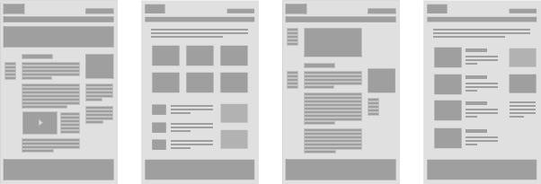
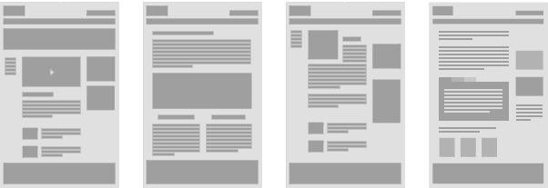

# Gestaltung · Layout und Raster

::: TOC
**Content**
[[TOC]]
:::

## Grundsatz
Es gibt diverse Konzepte und Ansätze um im Browser ein gewünschtes Layout zu erzielen. Bevor responsive Webdesign «erfunden» wurde, gab es oftmals eher fixe Strukturen und Layouts, die auf Mobilescreens meist schlecht dargestellt wurden. Mit responsive Design wird entsprechend der Ausgabegrösse das Layout angepasst.

Was im Print-Design als «Musterseiten» definiert wurde, wird im Webdesign meist als Templates zusammengefasst. Doch es können auch modulare Strukturen zu einer Seite zusammengebaut werden.

 

### Templates
Bei einem Aufbau mit verschiedenen Templates wird eine kleine Anzahl von Layout-Vorlagen realisiert und können dann so angewendet werden.
 
 
:::: grid
::: w80p

:::
::::
 

### Module
Bei einem Aufbau mit Modulen können immer wieder die selben Teile verwendet werden und so auf eine vielfältige Weise ein Layout erstellt werden.
 
 

 
 

<!--
 
 

-->

## Spalten
Oftmals wird im Webdesign ein Spaltenaufbau gewählt. Diese Unterteilung hilft bei der Strukturierung von Inhalten in horizontaler Richtung. Die vertikale Unterteilung wird oftmals weniger starr behandelt, da die Inhalte je nach Screengrösse länger (höher) oder kürzer werden.
 
 
 
 

::: margin compact
#### 12 Spalten als Beispiel
Eine beliebte Form für Desktop-Screens ist ein Raster mit 12 Spalten.
Darin lassen sich wiederum breitere Spalten-Konstrukte abbilden. So kann der Text zum Beispiel Zwei-, Drei, Vier- oder Sechspaltig eingefüllte werden.
:::

## Abstände
Abstände zwischen Elementen können aus technischer sicht im Webdesign auf verschiedene Arten definiert werden. Meist wird jedoch einem Inhaltselement ein so genanntes «Padding» (CSS-Definition) gegeben. Dies definiert einen «Abstand» gegenüber dem Nachbar. Das nächste Element ist dann gleich anschliessend an das vorhergehende und durch das Padding entsteht dann der Abstand zwischen den Elementen.
 
 

::: margin compact
### Visuelle Erscheinung
Die Inhaltselemente erscheinen auf dem Bildschirm mit einem Abstand zwischen den beiden Blöcken.
:::

::: margin compact
### Gleichmässiges Padding
Der Weissraum um die einzelnen Elemente wird gleichmässig zwischen den Elementen verteilt.
:::

::: margin compact
### Padding nach rechts/unten
Der Weissraum wird beim vorhergehenden Element so definiert, dass das folgende Element bereits den Abstand wahrt. Das zweite Element braucht dann kein seitliches Padding mehr.
:::

## Klassischer Webaufbau
Bei einem klassischen Aufbau werden die Inhalte fix an gewissen Positionen angeordnet. Die Mobile-Version ist häufig nicht separat angepasst worden und erscheint unbrauchbar.

::::: grid fullsize space2

:::: col_4of12
::: w40p

:::
::::

:::: col_8of12_last

::::
:::::

::::: grid fullsize space1

:::: col_4of12

 
 
 

Zwei Spalten fix in Pixel definiert.
Links und Rechts erscheint der Hintergrund
::::

:::: col_8of12_last

::::
:::::

## Klassischer Webaufbau – Varriationen

::::: grid fullsize space3

:::: col_4of12
 
 
 
Zwei Spalten fix in Prozent des Bildschirms definiert.

### ACHTUNG!
Zeilenumbruch und Layout schwer zu kontrollieren.
::::

:::: col_8of12_last

::::
:::::

::::: grid fullsize space3

:::: col_4of12
 
 
 
Die Hauptspalte ist fliessend. Der Rest ist fix definiert.

### ACHTUNG!
Zeilenumbruch und Layout schwer zu kontrollieren.
::::

:::: col_8of12_last

::::
:::::

## Rasteraufbau mit «Responsive Design»
Bei diesem Aufbau werden die Inhalte auf einen Raster gelegt. Die mobile Seite wird speziell für das kleine Endgerät angepasst.

::::: grid fullsize space2

:::: col_4of12
::: w40p

:::
::::

:::: col_8of12_last

::::
:::::

::::: grid fullsize space1

:::: col_4of12
 
 
 
&nbsp;
::::

:::: col_8of12_last

::::
:::::

Spalten können fix oder in % definiert werden. Meist wird jedoch die totale Breite aller Spalten durch ein Maximum kontrolliert.

## Rasteraufbau mit «Fluid Design»
Bei diesem modernen Aufbau werden die Inhalte häufig auf einen Raster gelegt aber die Inhalte ändern je nach Grösse des Bildschirmes die Grösse und Position.

::::: grid fullsize space2

:::: col_4of12
::: w40p

:::
::::

:::: col_8of12_last

::::
:::::

Bei fluiden Layouts passt sich der Inhalt möglichst gut für den Leser und Gestalter den Gegebenheiten an.

::::: grid fullsize space3

:::: col_6of12

::::

:::: col_6of12_last
::: w80p_left

:::
::::
:::::

::: margin printonly
#### Autor
Stefan Huber  
sh@signalwerk.ch  
+41 78 744 37 38

#### Dokumentgeschichte
Mai 2014: Erstellung  
August 2015: Erweiterung  
März 2017: Erweiterung

:::

## Weiterführende Informationen

### Rastersysteme
* [Foundation Grid](http://foundation.zurb.com/grid.html)
* [Gridpak](http://gridpak.com/)
* [960px Grid](http://960.gs/)
* [Skizzepapier](http://sneakpeekit.com/browser-sketchsheets/)

### Übliche Bildschirmauflösungen
* [Browser Market](http://gs.statcounter.com/)
* [Browser Display Statistics](http://www.w3schools.com/browsers/browsers_display.asp)

### Responsive Visualisierung
* [Responsinator](http://www.responsinator.com/)
