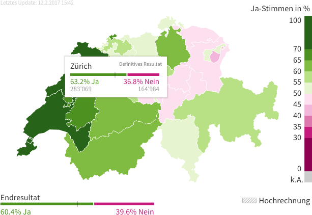

# Gestaltung · Interaktion mit Inhalten

::: TOC
**Content**
[[TOC]]
:::

::: margin
### Definition von Interaktion
Interaktion bezeichnet das wechselseitige Aufeinandereinwirken von Akteuren oder Systemen und ist eng verknüpft mit den übergeordneten Begriffen Kommunikation, Handeln und Arbeit. Manchmal werden diese Begriffe sogar synonym verwendet.

Quelle:
[Interaktion – Wikipedia](http://de.wikipedia.org/wiki/Interaktion)
:::
## Interaktion mit Autor
Die Kommunikation zwischen einem Sender und einem Empfänger ist bei einem Massenmedium, zu welchem das Internet gezählt werden darf, oftmals nur in eine Richtung oder maximal noch selektiv wechselwirkend. Die Interaktion ist also stark eingeschränkt und in den klassischen Medien ist die Interaktion unter Kontrolle des Senders, welcher auch mit der grösseren Reichweite aufwarten kann.

Klassische Beispiele aus den analogen Medien für eine eingeschränkte Interaktion sind zum Beispiel:

* Leserbriefe (Zeitung)
* Richtigstellungen (Fernsehen)
* Hörermeldungen (Radio)

 

::::: grid fullsize space1
::: w90p

:::
:::::

 

### Neue Medien
Die Regeln der Massenmedien sind auch im Internet an zu wenden. Doch oft werden Rückkanäle ohne die Filterung des ursprünglichen Senders aufgebaut.

::::: grid fullsize space2
::: w90p

:::
:::::

## Inhalte interaktiv erschliessen
Neben der wechselseitigen Kommunikation zwischen einem Sender und dem Empfänger, welche auf der Ebene der Autorenschaft statt findet, kann ein Austausch auch zwischen einem Benutzer und den bereits vorbereiteten Inhalten von statten gehen. Häufig wird dabei die Einschränkung der Information und sukzessives Erfahren und Erkunden der weiteren Inhalte als Interaktion wahr genommen. Im Gegensatz zu linearen Medien wie Buch, Fernseher oder Radio, ist der User bei neuen Medien in der Lage seinen Weg, durch ein thematische Einheit, selber zu suchen.

### Verlinken von Inhalten
Die wohl einfachste Art der Interaktion im Internet ist das verknüpfen von Inhalten über mehrere Seiten hinweg. Dabei kann der Benutzer frei wählen, wie er weiter navigieren soll und welche Inhalte er nun beziehen möchte.

 

:::: margin
Der Text wird relativ lieblos und ungepflegt abgeschnitten und über einen weiteren Link gerät man zum vollen Inhalt.

Quelle: [mediaforum (2014)](http://www.mediaforum.ch)
::::
::: imageline

:::

### Aufdecken von Inhalten
Inhalte können wie zum Beispiel in News-Portalen angerissen werden und erst dann über eine weitere Interaktion zum vollen Inhalt ausgebaut werden. Dabei kann der Inhalt nachgeladen und ergänzt werden, oder es wird auf eine neue Seite gelinkt. Oft wird dies gemacht um schnell eine Übersicht über diverse Themen zu bekommen und einen raschen Einstieg zu ermöglichen.

::::: grid fullsize space2

:::: col_6of12
::: imageline

:::
::::

:::: col_6of12_last

::::

Bei [The New York Times](https://www.nytimes.com/) werden ergänzende Inhalte aufgedeckt und überblendet. Dadurch kann der Benutzer seine Inhalte erhalten ohne dabei den ursprünglichen Kommunikationsstrang (Artikel) zu verlieren.

:::::

## Kommentare

::: margin compact
### Ein-Prozent-Regel
Jakob Nielsen (Usability Experte) hat 2006 die 90-9-1-Regel (auch: Ein-Prozent-Regel) geprägt.

#### Nutzer
90 % konsumieren nur  
 9 % beteiligen sich gelegentlich  
 1 % tragen aktiv Inhalte bei
:::

Eine der ältesten Formen einer Interaktion auf Websites ist die Kommentar-Funktion. Viele breitenwirksame Websites bieten heute eine solche Funktionalität um dem Benutzer auf dem eignen Medium einen Rückkanal zu geben. Bei grösseren Websites im Bereich von News oder Blogs spielen diese Funktionen für gewisse Empfänger eine entscheidende Rolle. Es gibt je nach Standpunkt der Redaktion oder des Autors oftmals zwei Weisen, wie mit Kommentaren umgegangen wird:

* Es werden alle Kommentare sofort frei gegeben und wo nötig oder wo Reklamationen eintreffen, wird korrigieren eingewirkt. Die Kommentare können hier selbstständig und ohne die Redaktion funktionieren.
* Kommentare werden zuerst gesichtet und danach frei gegeben. Oftmals schreibt die Redaktion gleichzeitig auch Rückmeldungen.

::::: grid fullsize space3 printonly

:::: col_4of12

::: imageline upscale w90p

:::
 
Im Anreisser auf der Homepage wird bereits auf die Anzahl Kommentare hingewiesen.
::::

:::: col_8of12_last
::: imageline

:::

Unterhalb eines Artikels wird die Kommentar-Funktion eingefügt.
Auf Kommentare kann meist auch wieder kommentiert werden.
::::
:::::
Quelle: [tagesanzeiger.ch](http://www.tagesanzeiger.ch/)

## Foren – Kommentare als Quelle
Es gibt Websites, bei denen Kommentare oder Fragen als einziger Inhalt dient. Es handelt sich also eher um eine Generierung von Inhalten, denn um eine Interaktion mit einem ursprünglichen Empfänger. Dennoch kommen auf solchen Sites oft intensive Diskussionen zu Stande.

:::: grid space1
::: margin compact
Reddit.com ist eine Sammlung von bewerteten Kommentaren. Durch die Beliebtheit
der Kommentare regelt sich auch der Inhalt.
:::

::: grid w90p imageline

:::
::::

 

### Social Media als Kommentare – Kommentare als Social Media

Social Media Seiten (Facebook, Twitter) können für sich selber gesehen schon als Kommentare gewertet werden. Diese Kommentare beziehen sich jedoch meist auf eine aktuelle Situation im Leben oder auf eine andere Person.
Daneben gibt es aber auch Dienste, die das Verwalten und Sammeln von Kommentaren der angemeldeten Benutzers zum Ziel haben und damit eine eigene soziale Interaktion bilden.

:::: grid space1
::: margin compact
disqus.com macht die Kommentare verschiedener Seiten von Benutzern zugänglich.
:::
::: grid w90p imageline

:::
::::

## Interaktion mit Daten
Daten für einen Leser leicht erfassbar zu machen, kann über eine Visualisierung vereinfacht werfen. Dabei werden ansonsten abstrakte Zusammenhänge vereinfacht und zum Teil auch mit einfacher verständlichen Bezugspunkten versehen.

::::: grid fullsize space2

:::: col_6of12

Eine Interaktive Karte von Wahlresultaten kann eine schnelle Übersicht über die Regionen geben.

Quelle: [tagesanzeiger.ch](http://www.tagesanzeiger.ch)

::::

:::: col_6of12_last

Daneben sind die Details ausgeblendet und nur auf Abruf (Rollover) ersichtlich.
::::

:::::

### Informationsdichte
Je dichter der Informationsgehalt ist,
desto eher müssen Konzepte gefunden
werden, um Information zu reduzieren.

 
 

::: margin
Quelle: [Digitale Gesellschaft – Vorratsdatenspeicherung](https://www.digitale-gesellschaft.ch/vds.html)
:::

Im Bild werden sämtliche Bewegungsdaten
vom Politiker Balthasar Glättli während
mehreren Monaten gezeigt. Die selbe
Information wird auch auf mehrere Arten
dargestellt.

## Rechtliches
Grundsätzlich dulden Hosting-Provider und Site-Betreiber keine Rechtsverletzungen, die durch User (Posts, Kommentare, ...) begangen werden. Die Handhabung hierzu ist jedoch unterschiedlich geregelt. Redaktionen können Inhalte schnell und unkompliziert löschen und tun dies auch oft, wenn sie auf rechtswiedrige oder verletzende Kommentare aufmerksam gemacht werden. Darüber hinaus kann auch über die Provider eingegriffen werden. Meist regeln die schweizer Provider über ihre Verträge ein Vorgehen, welches von der Swiss Internet Industry Association in ihrem Code of conduct vorgeschlagenen ist. Dieser sieht vor, dass bei Verstössen gegen das Urheberrecht, der Rechtehalter sich beim Provider melden kann und dieser den Website-Betreiber bittet die entsprechenden Inhalte zu entfernen. Sollte dies nicht geschehen, wird der Inhalt vom Hoster zensiert/­gelöscht. Dieses Vorgehen ist im schweizer Recht (noch) nicht so geregelt, wird aber durch Verträge meist so verinbart. Dieses Vorgehen kann durchaus kritisch gesehen werden, da ein allfälliger Rechteinhaber eventuell auch zu Unrecht in die publizistische Freiheit eingreiffen kann oder sogar mutwillige Manipulation versucht werden kann.
Die Arbeitsgruppe zum Urheberrecht (AGUR12) hat dieses Vorgehen auch dem Bundesrat vorgeschlagen, welcher eine modernisierung des Urheberrechts anstrebt. Auch auf europäischer Ebene ist das Urheberrecht im moment stark diskutiert.

### Strafrecht
Üble Nachrede (Art. 173) und Verleumdung (Art. 174) sind im schweizerischen Strafgesetzbuch (StGB) geregelt und können verurteilt werden. Diese Gesetzte gelten natürlich auch bei Inhalten und Kommentaren im Internet.

 
 

::: margin
#### Veruteilungen
Die Straftaten betreffend Ehrverletzung und Verleumdung sind in der Schweiz stark zunehmend.

Quelle: Bundesamt für Statistik
(Verurteilungen für ein Vergehen oder Verbrechen – Erwachsene)
:::

!!!include(./interaction/img/straftaten.svg)!!!

<!-- "https://www.bfs.admin.ch/bfs/de/home/statistiken/kriminalitaet-strafrecht.assetdetail.333911.html -->
<!-- "https://www.pxweb.bfs.admin.ch/Selection.aspx -->

 

!!!include(./interaction/straftaten.md)!!!

::: margin printonly
#### Autor
Stefan Huber  
sh@signalwerk.ch  
+41 78 744 37 38

#### Dokumentgeschichte
Juni 2014: Erstellung  
September 2015: Erweiterung  
März 2017: Erweiterung
:::

## Weiterführende Informationen

### Kommentare als Inhalt
* [reddit](http://www.reddit.com/)
* [Twitter](https://twitter.com/)
* [Facebook](https://www.facebook.com/)

### Urheberrechtsverletzende Kommentare (Inhalte)
* [Eidgenössisches Institut für Geistiges Eigentum – AGUR12](https://www.ige.ch/de/urheberrecht/agur12.html)
* [Branchenverband der Schweizer Internet Dienstleister – simsa](http://simsa.ch/)

### Interaktion zwischen Web-Benutzern
* [Mozilla Labs – TogetherJS](https://togetherjs.com)

### Info-Grafiken
* [Galaxy of Covers](https://lab.interactivethings.com/galaxy-of-covers/)
* [tagesanzeiger.ch – Maps](http://www.tagesanzeiger.ch/23568013)
* [Location Matters - NYTimes.com](http://www.nytimes.com/2013/07/22/business/in-climbing-income-ladder-location-matters.html)
* [Digitale Gesellschaft – Vorratsdatenspeicherung](https://www.digitale-gesellschaft.ch/vds.html)
* [512 Paths to the White House -  NYTimes.com](http://www.nytimes.com/interactive/2012/11/02/us/politics/paths-to-the-white-house.html)
