# Gestaltung · Geräte und deren Bedienung

::: TOC
**Content**
[[TOC]]
:::

## Mobile Geräte
Bereits 1972 (Studie bereits 1968) beschrieb Alan Kay eine Vision, wie tragbare Geräte für Kinder einfach zugänglich aussehen könnten. In seinem Entwurf für Xerox PARC Zeigte er ein mobiles Gerät, was aus damaliger Sicht mehr an ein Buch, denn an ein Computer erinnerte. Die Studie war jedoch aus technischer Sicht noch nicht realisierbar, führte aber zu weiteren Entwicklungen für mobile Rechner.  
Tragbare Computer wurden seit Mitte der 1970er Jahre produziert. Die Verkaufszahlen waren jedoch im Vergleich zu den Desktop Computern lange Zeit verschwindend klein und die Dimensionen nicht geeignet für den Gebrauch unterwegs. Mobil oder tragbar meinte damals eher die Möglichkeit ein Gerät mit zu nehmen und weniger es unterwegs zu gebrauchen.

 
 
 
 

::::: grid fullsize

:::: col_6of12
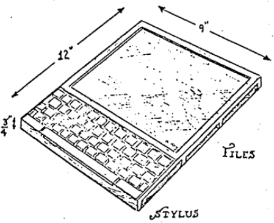
::::

:::: col_6of12_last
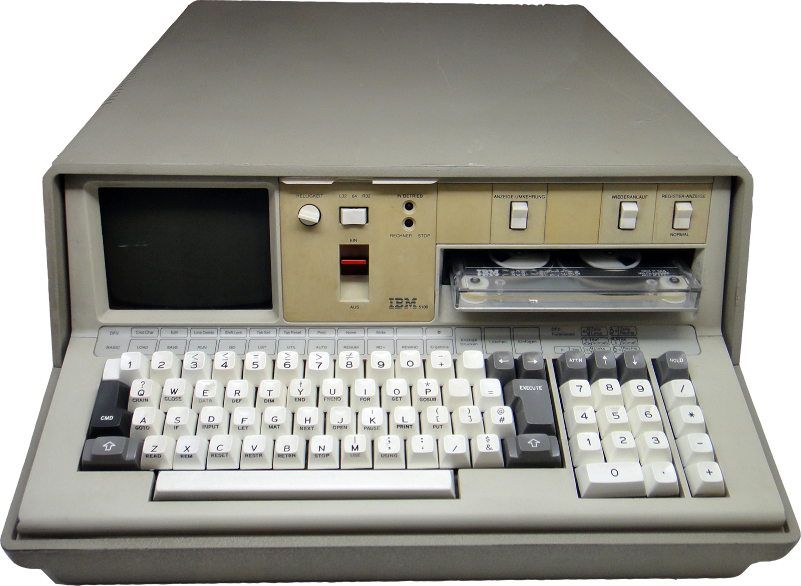

::::
:::::

::::: grid fullsize

:::: col_6of12
Dynabook von Alan Kay aus dem Jahre 1972
Vison eines Computers für Kinder
::::

:::: col_6of12_last
Der IBM 5100 war der erste «Portable Computer».
Erscheinungsjahr: 1975

::::
:::::

 
 
 
 

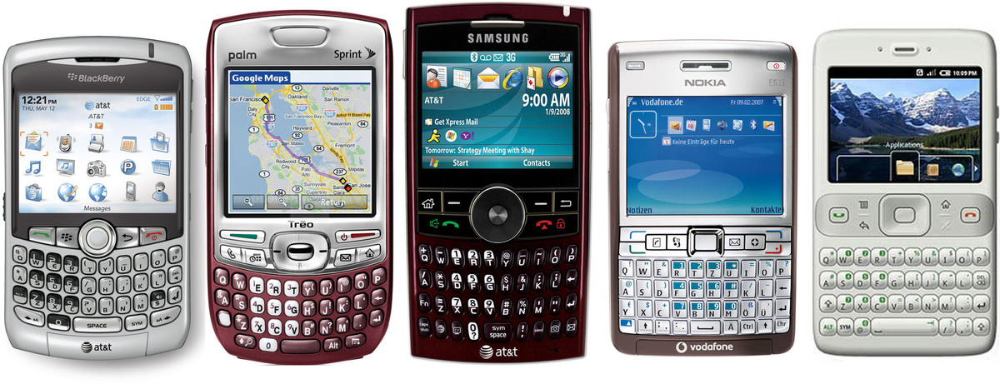

In den Anfängen der 2000er Jahre wurden so genannte «Featurephones» und erste «Smartphones» – oft noch mit Hardware-Tastatur und ohne Touchscreen – produziert.

## Smartphone und Touch-Devices
Seit den frühen 2000er Jahren gab es diverse mobile Telefone, die vermehrt mit grösseren Displays ausgestattet waren und deren Software und Hardware genügend leistungsfähig wurde um ernsthafte Aufgaben zu bewältigen. Die Betrachtung und die Bedienung einer Website durch einem Mobile-Gerät war mühsam bis unmöglich.

 

::: margin compact
#### Smartphones
Verkaufte Smartphones weltweit
 
 
!!!include(./interface/smartphoneinfo.md)!!!

 
 

Zum Vergleich:
Im Jahr 2014 wurden
weltweit 308 Millionen
Computer verkauft.

:::

!!!include(./interface/img/smartphones.svg)!!!

 

Quellen: [Statista](http://www.statista.com/)

 
 
 

### iPhone als Game-Changer
::: margin
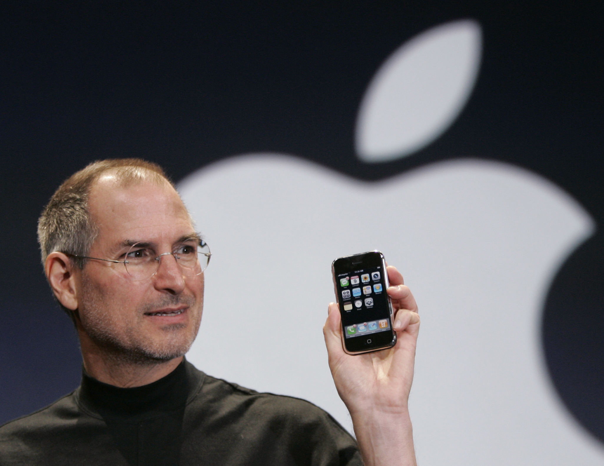
Steve Jobs präsentiert an der MacWorld 2007 das
erste iPhone. Das Gerät kommt mit Touchscreen
und eingebautem Browser, der keine wesentlichen technischen Einschränkungen gegenüber einem Desktop-Browser besitzt (full fledged Browser).
:::
Im Jahr 2007 präsentierte Apple mit dem iPhone ein Telefon, welches nicht nur das tätigen von Anrufen im Fokus hatte, sondern auch einen leistungsfähigen Browser eingebaut hatte und später auch durch weitere Apps erweitert werden konnte.
Auch wenn es davor schon andere Hersteller gab, die ähnliche Konzepte versuchten, so ist mit der Einführung des iPhones das Bedienkonzept von heutigen mobilen Geräten zementiert worden; Die Geräte verfügen über grosse (im Vergleich zur Gerätedimension) Bildschirme und die Bedienung erfolgt mittels Fingergesten.

## Mobiles Internet
Durch die Verfügbarkeit von Internet auf mobilen Geräten und der zunehmenden Fähigkeiten der Geräte, steigt der prozentuale Anteil an mobilen Geräten und Daten am gesamten Internet-Verkehr. Somit werden die mobilen Geräte stetig wichtiger im Alltag und das Design der besuchten Seiten sollte entsprechend angepasst sein.

 

::: margin compact
#### Schweiz
Internetnutzung
nach Gerätetypen
 
 
in %

 
!!!include(./responsive/deviceinfo.md)!!!
:::

!!!include(./responsive/img/CH_device.svg)!!!

Quellen: [StatCounter](http://gs.statcounter.com/)

 
 

### Geschwindigkeit
Durch die drastische Zunahme an Bandbreite zur Datenübertragung, können speicherintensive Inhalte (wie zum Beispiel Videos) auch auf mobilen Geräten problemlos konsumiert werden.

 

::: margin compact
#### Datenübertragung
Mobilfunk-Standards – 3G und neuer
 
 
Angaben in MBit/s
 
!!!include(./interface/speedinfo.md)!!!
:::

!!!include(./interface/img/speed.svg)!!!

Quellen: [telecomtalk](http://telecomtalk.info/)

## Grösse vom Touch-Interface
::: margin compact
### Fingerbreite
Gemäss Studie von MIT beträgt die Fingerbreite 16 – 20 mm

Quelle: [Transactions of the ASME](http://touchlab.mit.edu/ publications/2003_009.pdf)
:::

Die breite eines Fingers ist von Person zu Person verschieden. Auch spielt es eine Rolle, wie stark aufgedrückt wir und wie die Sensoren des Gerätes diesen Erfassen. Hoch aufgelöste Geräte haben meist einen Device pixel ratio (dppx) der grösser als 1 dppx ist. Somit wird eine Definition von 1 px im CSS auf dem Gerät mit mehreren Pixeln wiedergegeben. Bei der minimalen Grössenangabe einer Schaltfläche kann somit keine absolute Aussage gemacht werden. Apple empfielt 22 px × dppx (iPhone Human Interface Guidelines), Microsoft 9 mm (Windows Phone UI Design and Interaction Guide) und Nokia 10 mm (Nokia's developer resources).

 
 

::::: grid fullsize

:::: col_6of12
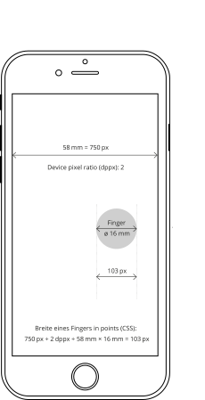
### iPhone 6s
Berechnung der Fingerbreite in Pixel
::::

:::: col_6of12_last
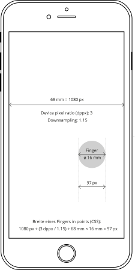
### iPhone 6s Plus
Berechnung der Fingerbreite in Pixel
::::
:::::

## Touch vs. Click
Je nach Gerät sind andere Eingabekonzepte geeignet. Beim genauen Betrachten der Bedinung ergeben sich auch Ableitungen für das Design. Für die Bedienung mit dem Finger ist vor allem wichtig, dass kein Cursur sichtbar ist und es somit auch kein Hover-Status (rollover) gibt.

 
 

::::: grid fullsize

| {.w33p}                | Maus {.w33p}                       | Finger {.w33p}             |
|------------------------|------------------------------------|----------------------------|
| Präzision              | hoch                               | gering                     |
| Erlernbarkeit          | eher schwer                        | einfach                    |
| Sichtbarer Cursor      | Ja                                 | Nein                       |
| Zeige-Punkte           | 1                                  | meist 1 – 3                |
| Controls               | 1 – 3 (links/rechts Klick, scroll) | 1                          |
| Schleppspur*           | Ja                                 | Nein                       |
| Status                 | hover, mouse-down, mouse-up, move  | touch-down, touch-up, drag |
| Beschleunigung**       | Ja                                 | Nein                       |
| Geeignete Screengrösse | unbeschränkt                       | nur geringe Grössen        |

\* Schleppspur: Um von einem Punkt zum anderen Punkt zu kommen, muss der Weg dazwischen mit der Maus gefahren werden.  
\** Beschleunigung: Während der Bewegung von A nach B ist die Bewegung nicht linear zur Fingerbewegung.

:::::

 
 
 

### Präzision
Mit einer Maus kann wesentlich genauer gearbeitet werden, als mit dem Finger. Somit müssen die minimalen Schaltflächen (Links) angepasst werden. Sollte keine angrenzenden Schaltflächen existieren, kann auch der zu klickende Bereich vergrössert werden, ohne jedoch die visuelle Grösse zu verändern.

 
 

::::: grid

:::: col_6of12

Kleine Schaltfläche
::::

:::: col_6of12_last

Kleine Schaltfläche mit nicht sichtbarem Bereich um die Treffergenauigkeit zu erhöhen.
::::
:::::

## Touch-Points und Gesten

::: margin compact

### Anzahl Touch-Points
iPhone: maximal 5 Touch-Points  
iPad: maximal 11 Touch-Points  
Android: divers, minimal 2 Touch-Points  
:::

Die meisten modernen Touch-Geräte können mehrere Finger auf dem Touchscreen erkennen. Somit kann durch die Kombination der Finger oder durch die Bewegung der Finger eine so genannte Geste gemacht werden, welche dann von der Website oder vom Gerät abgefangen werden kann und entsprechend reagiert wird.

 
 
 

::::: grid fullsize

:::: col_6of12

### Touch
::::

:::: col_6of12_last
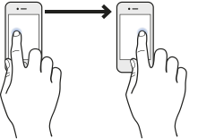
### Swipe
::::
:::::

 
 
 
 

::::: grid fullsize

:::: col_6of12

### Pinch in (spread)
::::

:::: col_6of12_last

### Pinch out
::::
:::::

 
 
 
 

::: margin compact
Bildquelle:  
Event Handling Guide for iOS, Apple
:::

## Texteingabe
Wurden früher noch oft Hardware-Buttons oder Hardware-Keyboards verbaut, so wurden diese in den letzten Jahren fast vollständig durch On-Screen-Keyboards ersetzt. Diese haben den wesentlichen Nachteil, dass es keinen Hub gibt und somit haben diese ein weniger präzises haptisches Feedback – im Vergleich zu einer Taste – sind dafür wesentlich vielseitiger in der Anwendung. So kann für die Sprache oder die Art der Eingabe ein jeweils anderes Keyboard eingeblendet werden. Auch kann der eingesparte Platz bei nicht Verwendung des Keyboards durch Inhalt genutzt werden.

 
 

::::: grid fullsize

:::: col_3of12
::: w70p

 
 
 
 

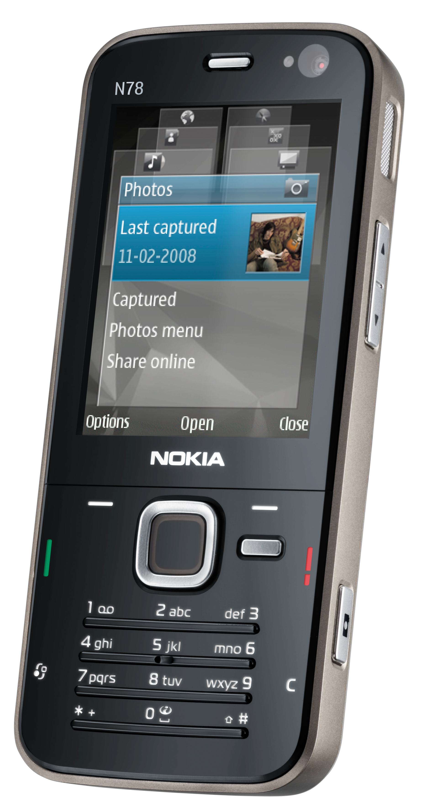
:::
::::

:::: col_5of12

 
 
 
 
 
 
 

::::

:::: col_4of12_last
::: w80p imageline

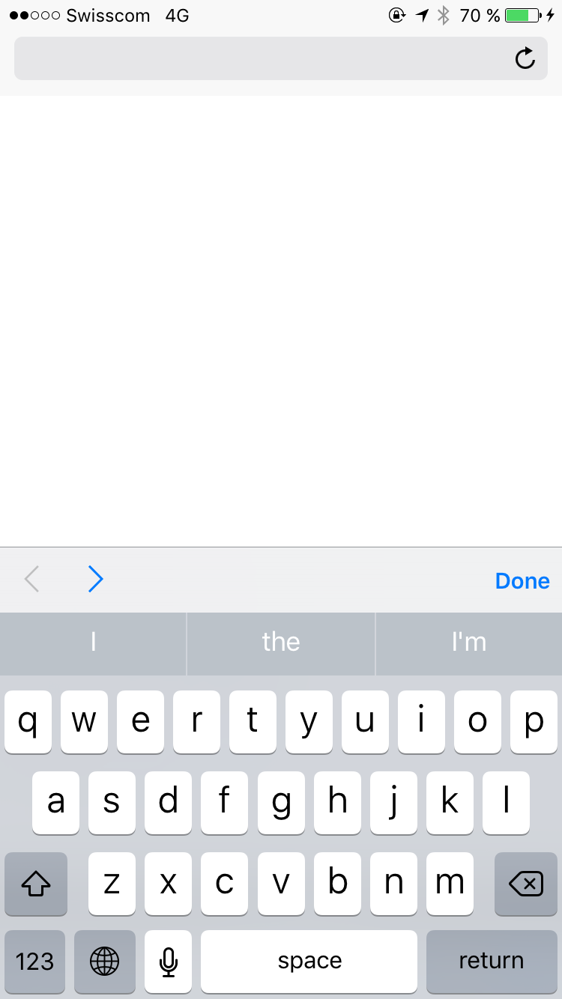
:::
::::

:::::

::::: grid fullsize

:::: col_4of12
### Keypad
Bei klassischen «Featurephones»
werden die Zahlen mit Buchstaben belegt. So muss, je nach gewünschtem Buchstabe, eine Zahl bis zu 4 × gedrückt werden. Das T9-System versuchte
aus einer Tastenkombination das Wort
zu erraten.
::::

:::: col_4of12
### Hardware Keyboard
Um ein möglichst schnelles Schreiben zu ermöglichen gibt es Telefone mit haptischen Tasten.
::::

:::: col_4of12_last
### On-Screen-Keyboard (soft keyboard)
Heute wird auf Smartphones meist mit einer auf dem Bildschirm eingeblendeten Tastatur geschrieben.
::::

:::::

 

::::: grid

:::: col_4of12
::: imageline
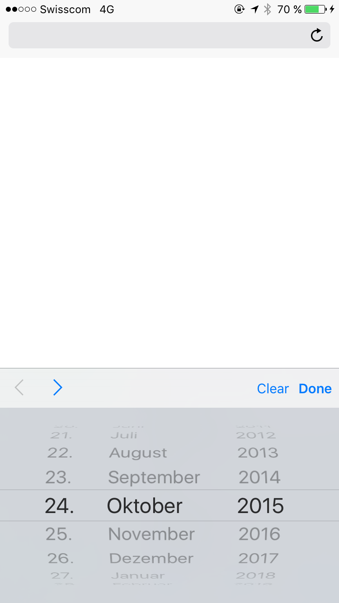
:::

Datumswahl

::::

:::: col_4of12
::: imageline
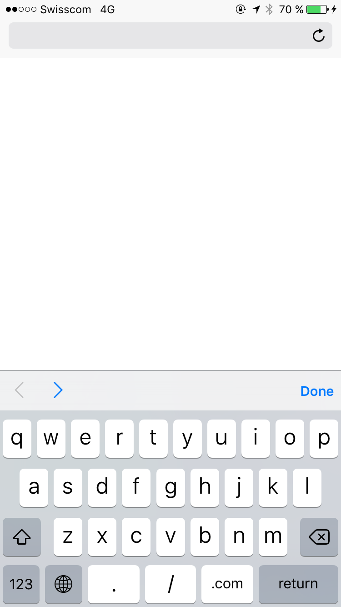
:::

URL-Eingabe

::::

:::: col_4of12_last
::: imageline
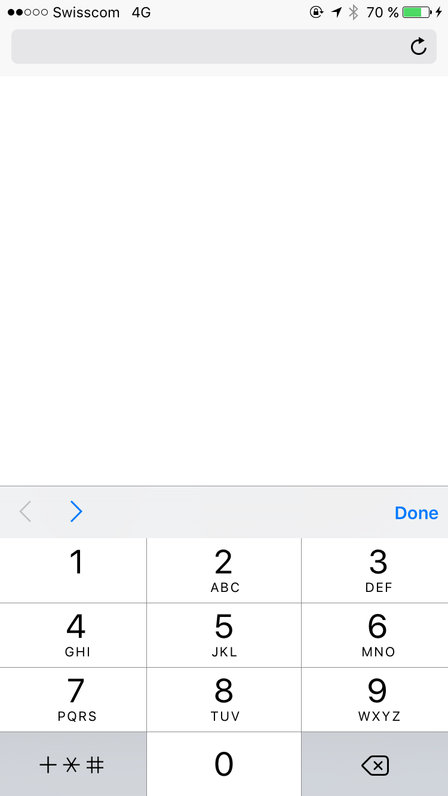
:::

Telefonnummer

::::
:::::

## Sensoren
::: margin compact
### Gesten durch Bewegung
Durch die Kombination von Gyroskop und Bewegungssensor kann relativ genau berechnet werden, wie sich ein Telefon gerade bewegt. So kann zum Beispiel ein Schütteln des Gerätes erkannt werden.

 
 

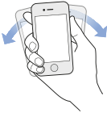

:::
Moderne Geräte haben heute diverse eingebaute Sensoren. Diese können dafür gebraucht werden um eine bessere Interaktion mit dem Benutzer herzustellen oder aber die Umstände, in denen sich der Benutzer gerade befinded zu erruieren. Über die Jahre sind in die mobilen Geräte immer mehr Sensoren Verbaut worden.

### Gyroskop
Das Gyroskop misst die Lage des Telefons in X-, Y- und Z-Achse. Dabei ist die Aussage der Position absolut zum Boden (Gravitation). Es kann also gesagt werden, in was für einer Lage sich das Telefon befindet, nicht aber wo sich das Telefon befindet.

### Bewegunssensor
Der Bewegunssensor gibt an, was für Beschleunigung oder negative Beschleunigung (Verzögerung) auf das Gerät ausgeübt wird. Es kann also bestimmt werden, ob das Gerät gerade bewegt wird.

### Magnetometer
Der Magnetometer misst die magnetische Flussdichte der Umgebung.  Dies ist vor allem für eine Kompassfunktion anhand des Erdmagnetfelds nützlich. Es kann ein Winkelmass zu Norden errechnet werden.

### Barometer
Der Barometer gibt den Luftdruck wieder. Dies kann sowohl zur Bestimmung von Wettereinflüsse genutzt werden, wie auch für Höhenveränderungen, da der Luftdruck mit zunehmendem Abstand von der Erdoberfläche abnimmt.

### GPS
Mit Hilfe von GPS (Global Positioning System) kann bestimmt werden, wo auf der Erde sich ein Gerät gerade befindet. Diese Positionierung ist Absolut und benötigt den Empfang von Satelitensignalen.

### Thermometer
Umgebungsthermometer werden eher selten in Telefone verbaut. Es gibt zwar Temperatur-Sensoren im innern des Gerätes, die den Betrieb des Telefons steuern und eine Überhitzung des Gerätes verhindern, jedoch werden diese Temperaturen meist nicht für den Benutzer zugänglich gemacht. Dies hat vor allem damit zu tun, dass durch die eigene Hitze des Geräts keine aussagekräftige Messung der Umgebungstemperatur möglich ist. Allgemein lässt sich sagen, dass Temperaturmessung für elektronische Consumer-Geräte relativ Schwierig ist und selten genauere Werte als ±0.5°C zu erwarten sind (Auflösung ≠ Genauigkeit).

## TV und Web
::: margin compact
### Spracheingabe
Die Erkennung von menschlicher Sprache wird immer besser. Dadurch werden auch vermehrt Spracherkennungen in Fernseher integriert, um das mühsame Schreiben mit der Fernbedienung zu erleichtern.
:::
Neue Fernseher haben oft eienen eingebauten Web-Browser. Dieser ist technisch meist gut bis sehr gut, jedoch ist die Bedienung durch das Fehlen einer intuitiven Eingabe oftmals eher schwerlich. Es gibt diverse Fernbedienungs-Konzepte und zum Teil auch die Möglichkeit, eine Tastatur oder eine Maus mit dem TV zu verbinden, doch ist dies wohl eher die Ausnahme. Es empfiehlt sich also eine Website, sofern diese für TV angepasst sein muss, mit der Tab-Reihenfolge so auf zu bereiten, dass diese über die Pfeiltasten einfach zu bedienen ist.

 
 
 

::: margin
### Grosser Funktionsumfang
Heutige Smart-TVs bieten ein reiches Angebot an Inhalten und auch an zusätzlichen Apps. Eine nicht speziell auf die Bedürfnisse des TVs angepasste Website ist aber eher schwer zu Bedienen.
:::
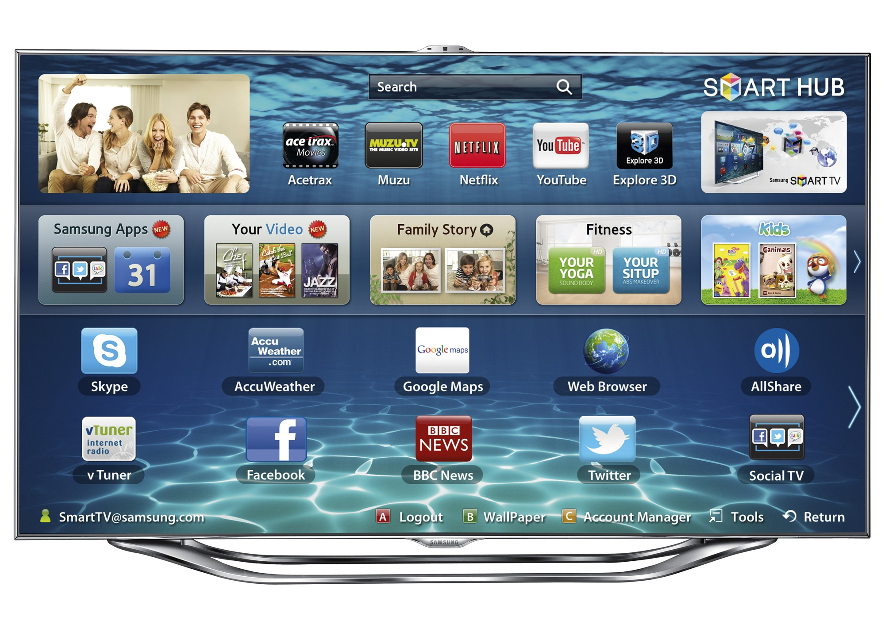

::::: grid fullsize

:::: col_4of12
::: w80p
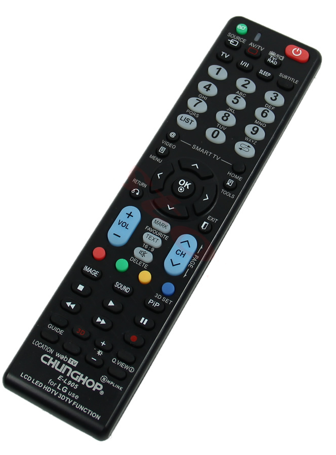
:::
::::

:::: col_4of12

 
 
 
 

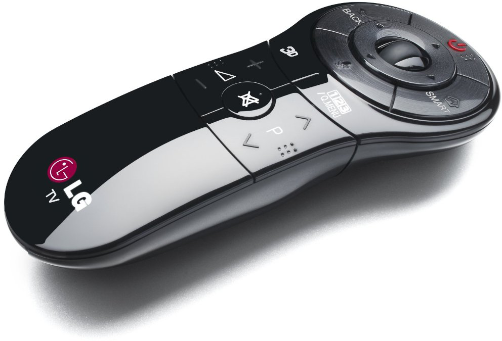
::::

:::: col_4of12_last

 
 
 
 
 

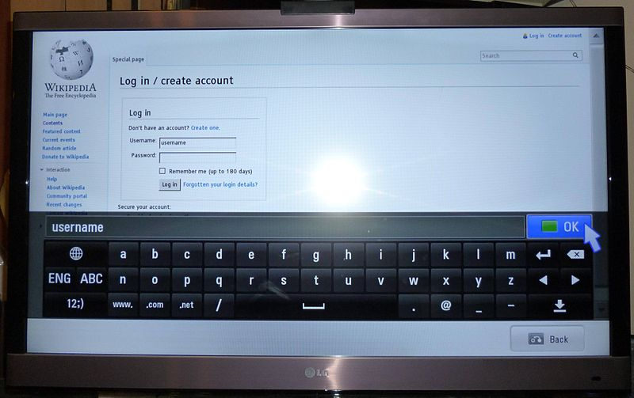
::::
:::::

::::: grid fullsize

:::: col_4of12
### Fernbedienung
Die klassischen Fernbedienungen haben meist nur Pfeiltasten.
::::

:::: col_4of12
### Fernbedienung mit Mausfunktion
Es gibt auch Fernbedienungen,
die der Funktionsweise der Maus nachempfunden sind.
::::

:::: col_4of12_last
### On-Screen-Tastatur
Die On-Screen-Tastaturen sind eher mühsam zu bedienen und ermglichen nur ein langsames schreiben.
::::

:::::

## Wearables (Uhr)
Seit einigen Jahren werden Warables meist in From von Uhren mit dem Internet verbunden. Meist haben die Geräte jedoch so einen kleinen Screen und nur eine beschränkte Eingabefähigkeit, so dass keine Browser installiert sind. Die Apps sind zwar mit dem Internet verbunden, benutzen jedoch zur Anzeige keine typische Web-Technologie.

::: w80p
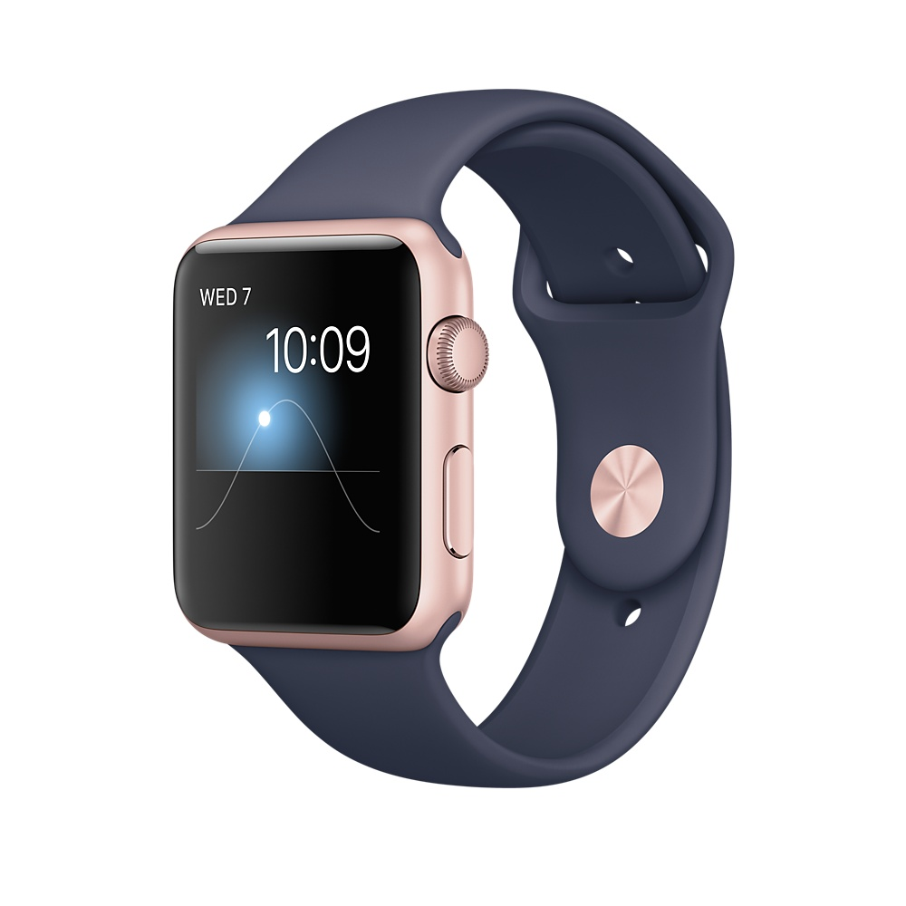
:::
Die Apple-Watch kann mit dem Finger bedient werden und bietet ein haptisches Feedback durch ein «klopfen» an den Finger.

::: margin printonly
#### Autor
Stefan Huber  
sh@signalwerk.ch  
+41 78 744 37 38

#### Dokumentgeschichte
Oktober 2015: Erstellung  
April 2017: Erweiterung  

:::

## Weiterführende Informationen

## History of mobile
* [Springboard: the secret history of the first real smartphone (Full Documentary)](https://www.youtube.com/watch?v=b9_Vh9h3Ohw)

### Geräte im Internet
* [Device-Agnostic](http://trentwalton.com/2014/03/10/device-agnostic/)
* [Your Content, Now Mobile](http://alistapart.com/article/your-content-now-mobile)
* [Mobilfunk-Abdeckung](https://scmplc.begasoft.ch/plcapp/pages/gis/netzabdeckung.jsf)
* [Asymco](http://www.asymco.com/)
* [Verkauf Smartphones ](https://www.statista.com/statistics/266219/global-smartphone-sales-since-1st-quarter-2009-by-operating-system/)
* [Ballmer Laughs at iPhone](https://www.youtube.com/watch?v=eywi0h_Y5_U)
* [Mobile Is Eating the World (2014)](http://www.slideshare.net/a16z/mobile-is-eating-the-world-40841467)

### Bildschirm und Grössen
* [iPhone Resolutions](https://www.paintcodeapp.com/news/ultimate-guide-to-iphone-resolutions)
* [Finger-Friendly Design](http://www.smashingmagazine.com/2012/02/finger-friendly-design-ideal-mobile-touchscreen-target-sizes/)

### Sensoren
* [DeviceOrientation in HTML](http://w3c.github.io/deviceorientation/spec-source-orientation.html)

### Eingabe
* [Eingabefelder in HTML5](http://www.wufoo.com/html5/)

### Touch und Multitouch
* [Multi-Touch Web Applications](http://blog.teamtreehouse.com/building-multi-touch-web-applications)
* [Touch Events](https://mobiforge.com/design-development/html5-mobile-web-touch-events)
* [iPad Multi-Touch](http://mattgemmell.com/ipad-multi-touch/)
* [Touch Gesture Reference Guide](http://www.lukew.com/ff/entry.asp?1071)
