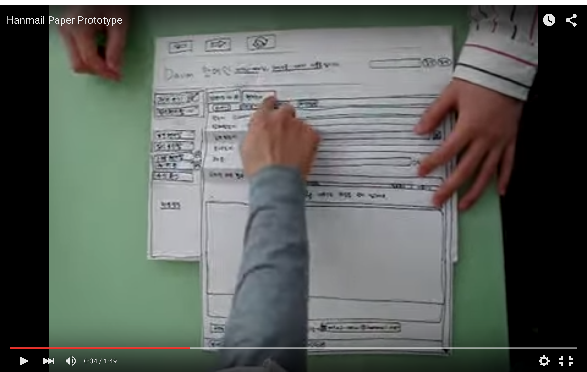
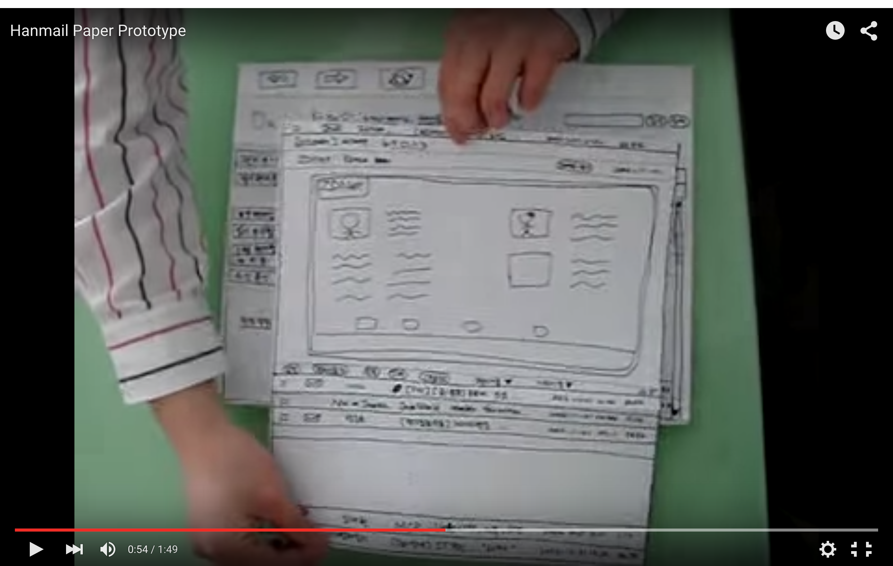
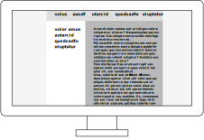

# Gestaltung · Paperprototyping & Screensizes

::: TOC
**Content**
[[TOC]]
:::

## Paperprototyping
Um möglichs schnell einen Entwurf einer Website zu bekommen und sich nicht in Details zu verlieren, werden zum Teil Papierprototypes erstellt. Dabei handelt es sich um auf Papier gefertigte Skizzen, die möglichst das Look and Feel der fertigen Website/App wiedergeben sollen.

Der Paperprototype sollte die Bildschirmauflösung im Verhältnis zu den Inhalten möglichst realistisch wiedergeben.

::: video space3 screenonly
<iframe src="https://www.youtube.com/embed/GrV2SZuRPv0" frameborder="0" allowfullscreen></iframe>
:::

::::: grid fullsize space3 printonly

:::: col_6of12

::::

:::: col_6of12_last

::::
Quelle: [Hanmail Paper Prototype - YouTube](https://youtu.be/GrV2SZuRPv0)
:::::

### Abläufe Zeigen
Durch verschiedene Papiere, Ausschnitte oder Falzungen können ganze Abläufe simuliert werden. Der Benutzer soll möglichst ein schnelles Verständnis für die Funktion und das Design erlangen.

## Screensizes

::::: grid fullsize space3

:::: col_4of12
::: w60p

:::
::::

:::: col_8of12_last
::: w90p

:::
::::

:::::

:::: grid fullsize space3
::: col_4of12
Bildschrim hat eine zu gerine Auflösung und kann Seite nicht vollständig anzeigen. Ungenügende technische Realisation für mobiles Gerät. Lässt sich vermeiden.
:::

::: col_8of12_last
Bildschrim hat eine grosse Auflösung und kann Seite vollständig anzeigen.
:::
::::

### Bildschirmauflösung
Je nach Auflösung des Bildschirms können mehr oder weniger Pixel auf der Ausgabefläche ausgegeben werden. Je mehr Pixel zur Verfügung stehen, desto grösser kann das Browser-Fenster aufgezogen werden. Bei Websites mit «fixem Layout» werden somit mehr oder weniger Inhalte sichtbar.

::: margin
#### Beispiel
Ein Tablet kann 3000 Pixel in der Breite anzeigen und hat eine Breite von 25,4 cm. Somit beträgt die Auflösung 300 dpi (in der Breite).

3000 Pixel / 10 Inch (25,4 cm) = 300 Dots per Inch
:::

### DPI
Eine Auflösungsdichte wird in DPI (Dots per Inch) angegeben. Diese Einheit gibt an, wie viele Bildpunkte pro Inch (25,4 mm = 1 Inch) – also eine Strecke – liegen. Je höher die Auflösung ist, desto weniger erkennt man die einzelnen Punkte in der Ausgabe und die Ausgabe wirkt weniger «verpixelt». Die Auflösung eines Bildschirms kann in DPI angegeben werden.

### DPI Wert ermitteln
Höhe oder Breite des Bildes in Pixel / Höhe oder Breite in Ausgabe (in Inch) = Auflösung in DPI (Dots per Inch)

::: margin printonly
#### Autor
Stefan Huber  
sh@signalwerk.ch  
+41 78 744 37 38

#### Dokumentgeschichte
August 2015: Erstellung  
Februar 2017: Erweiterung

:::

## Weiterführende Informationen

### Paperprototype
* [Hanmail Paper Prototype](https://youtu.be/GrV2SZuRPv0)
* [Runsii - Games Paper Prototype](https://youtu.be/x48qOA2Z_xQ)

### Übliche Bildschirmauflösungen
* [Browser Market](http://gs.statcounter.com/)
* [Browser Display Statistics](http://www.w3schools.com/browsers/browsers_display.asp)

### Screen Rendering
* [The Ultimate Guide To iPhone Resolutions](https://www.paintcodeapp.com/news/ultimate-guide-to-iphone-resolutions)
