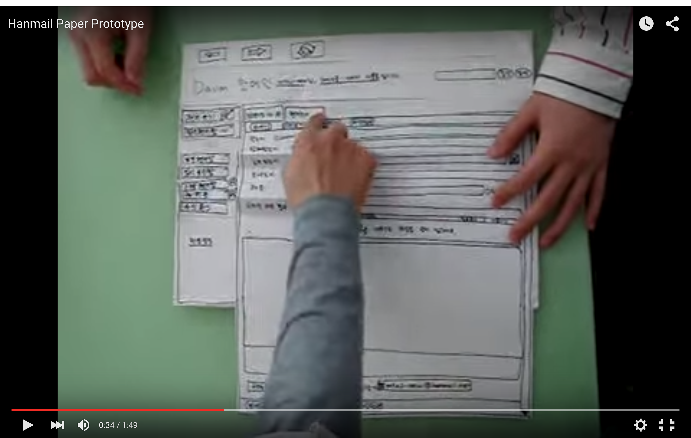
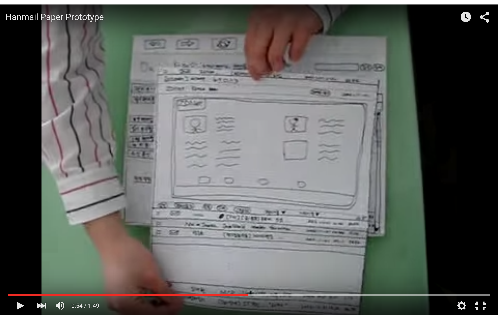

# Gestaltung · Paperprototyping

::: TOC
**Content**
[[TOC]]
:::

## Paperprototyping
Um möglichs schnell einen Entwurf einer Website zu bekommen und sich nicht in Details zu verlieren, werden zum Teil Papierprototypes erstellt. Dabei handelt es sich um auf Papier gefertigte Skizzen, die möglichst das Look and Feel der fertigen Website/App wiedergeben sollen.

Der Paperprototype sollte die Bildschirmauflösung im Verhältnis zu den Inhalten möglichst realistisch wiedergeben.

::: video space3 screenonly
<iframe src="https://www.youtube.com/embed/GrV2SZuRPv0" frameborder="0" allowfullscreen></iframe>
:::

::::: grid fullsize space3 printonly

:::: col_6of12

::::

:::: col_6of12_last

::::
Quelle: [Hanmail Paper Prototype - YouTube](https://youtu.be/GrV2SZuRPv0)
:::::

### Abläufe Zeigen
Durch verschiedene Papiere, Ausschnitte oder Falzungen können ganze Abläufe simuliert werden. Der Benutzer soll möglichst ein schnelles Verständnis für die Funktion und das Design erlangen.

::: margin printonly
#### Autor
Stefan Huber  
sh@signalwerk.ch  
+41 78 744 37 38

#### Dokumentgeschichte
August 2015: Erstellung  
Februar 2017: Erweiterung

:::

## Weiterführende Informationen

### Paperprototype
* [Hanmail Paper Prototype](https://youtu.be/GrV2SZuRPv0)
* [Runsii - Games Paper Prototype](https://youtu.be/x48qOA2Z_xQ)
