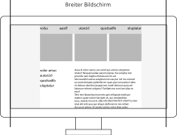
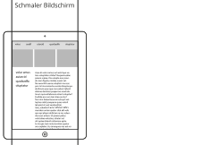
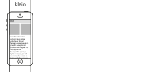
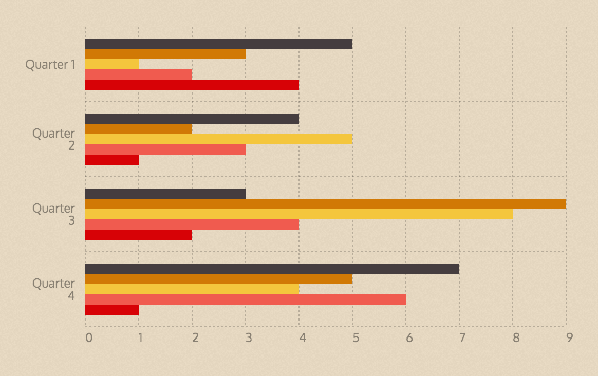
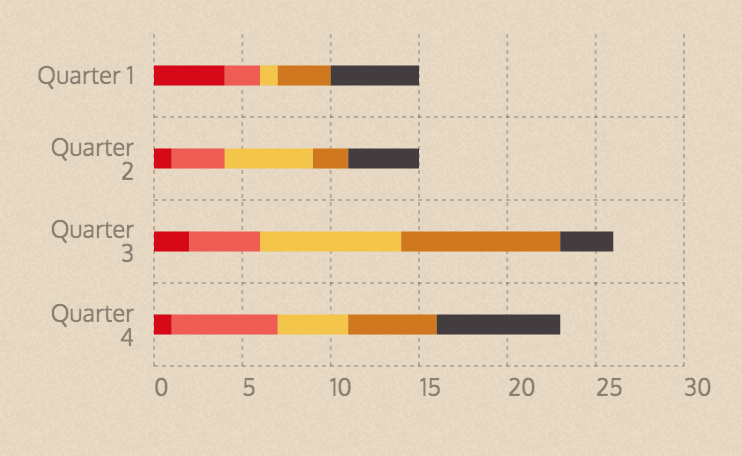
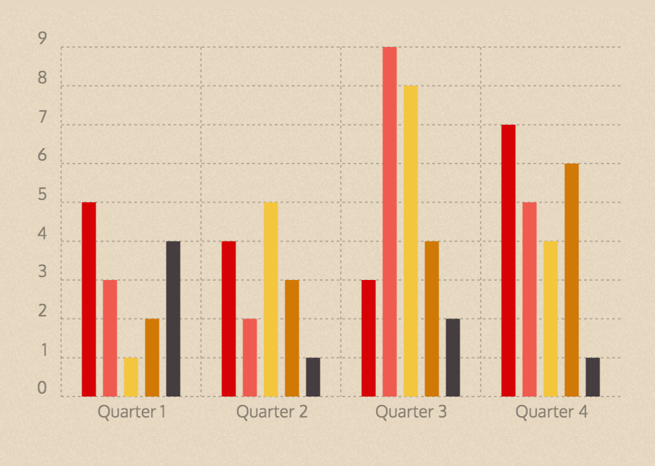

# Gestaltung · Responsive Design

::: TOC
**Content**
[[TOC]]
:::

# Responsive Design
Das Ziel beim responsiven Webdesign ist es, auf die Eigenschaften und Einschränkungen des jeweiligen Endgeräts mit best möglichen Design-Konzepten zu reagieren. Dies gilt insbesondere für Tablets und Smartphones, da diese kleine Bildschirme aufweisen und auch in der Bedienung weitaus gröber zu bedienen sein müssen, da als Eingabemittel kein Werkzeug, sondern der Finger dient.
Meist definiert man bei solchen Anpassungen so genannte Breakpoints bei denen das Layout jeweils wieder neu angepasst wird.

 
 

::: margin
#### Desktop – etwa 1000px und mehr
Der Breakpoint wird meist so
eingerichtet, dass ab etwa 1000px
keine separate Anpassungen
mehr gemacht werden, sondern nur noch ein Layout verwendet wird.
:::
::: grid w80p

:::
 

::: margin
#### Tablet – etwa 700px – 1000px
Für die Zwischengrösse zwischen
Mobile und Desktop wird zum Teil noch eine weitere Grösse angepasst.
:::
::: grid w80p

:::
 

::: margin
#### Mobile – weniger als 700px 
Für die kleinsten Geräte muss
meiste eine sehr radikale Layout-Anpassung gemacht werden.
:::

::: grid w80p

:::

## Mobile Geräte
Mobile Geräte haben einen sehr starken Zuwachs und machen jedes Jahre in den Statistiken der Besucherzahlen einen grösseren Anteil aus. Insbesondere Smartphones sind stetig wachsend. Tablet-Geräte sind nicht mehr stark wachsend.

#### Wichtige Einführungen von neuen Geräten
* iPhone, 29. Juni 2007
* iPad, 3. April 2010

 

::: margin compact
#### Schweiz
Internetnutzung
nach Gerätetypen
:::

!!!include(./responsive/img/CH_device.svg)!!!

 
!!!include(./responsive/deviceinfo.md)!!!

::: margin compact
#### Weltweit
Internetnutzung
nach Gerätetypen
:::

!!!include(./responsive/img/ALL_device.svg)!!!

 

Quellen: [StatCounter](http://gs.statcounter.com/)

## Responsive Inhalte
### Icons (Grafiken)
Icons können auf verschiednen Grössen verschiedene Detailgrade annehmen. Die Klarheit eines kleinen Icons kann in grossen Grössen grob wirken und feine Strukturen können in kleinen Grössen wegbrechen. Um dies zu vermeiden, können verschiedene Versionen abhängig von der Grösse und Auflösung gewählt werden.

::: grid fullsize

#### Icons und Grafiken abhängig von Grösse und Auflösung
Bild-Quelle: [Responsive Icons](http://responsiveicons.co.uk/)
:::

 
 
 

### Charts (Diagramme)
Da es bei Charts (Diagrammen) oftmals zu einer dichte an Informationen kommen kann, ist es sinnvoll, die Information entsprechend dem Raum zu optimieren. Dies gilt sowohl für die Typografie, wie auch die Darstellung.

::::: grid fullsize space2

:::: col_4of12

::: w80p

:::
::::

:::: col_8of12_last

::::
:::::

## Responsive Tabellen
Tabellen können bei kleinen Bildschirmen schnell zu breit wachsen. Es gibt diverse Konzepte, wie bei kleinen Bildschirmen die Daten umgeschichtet werden können, so dass zumindest die Information noch zugänglich ist.

::::: grid fullsize space2

:::::

::: margin printonly
#### Autor
Stefan Huber  
sh@signalwerk.ch  
+41 78 744 37 38

#### Dokumentgeschichte
September 2015: Erstellung  
März 2017: Erweiterung

:::

## Weiterführende Informationen

### Übliche Bildschirmauflösungen
* [StatCounter](http://gs.statcounter.com/)
* [Browser Display Statistics](http://www.w3schools.com/browsers/browsers_display.asp)

### Responsive Visualisierung
* [Responsinator](http://www.responsinator.com/)

### Responsive Design
* [A List Apart – Responsive Web Design](http://alistapart.com/article/responsive-web-design)
* [Übersicht – Responsive Web Design](https://responsivedesign.is/)

### Icon-Systeme & Responsive Icons
* [Iconic](https://useiconic.com/) (kommerziell)
* [History of Icons](https://historyoficons.com/)

### Responsive Charts
* [Responsive Charts](http://blog.apps.npr.org/2014/05/19/responsive-charts.html)
* [Chartist](https://gionkunz.github.io/chartist-js/examples.html)

### Responsive Tabellen
* [Responsive Tables](http://zurb.com/playground/projects/responsive-tables/index.html)
* [Responsive Tables — SitePoint](http://www.sitepoint.com/responsive-solutions-for-feature-comparison-tables/)
* [Responsive Table – css-tricks.com](https://css-tricks.com/examples/ResponsiveTables/responsive.php)
* [Responsive & Accessible](http://codepen.io/pixelchar/pen/rfuqK)
* [Responsive Tables](http://codepen.io/JasonAGross/pen/rjmyx)
* [Tablesaw - A Flexible Tool for Responsive Tables](http://www.filamentgroup.com/lab/tablesaw.html)
