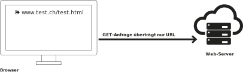
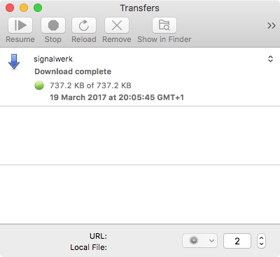
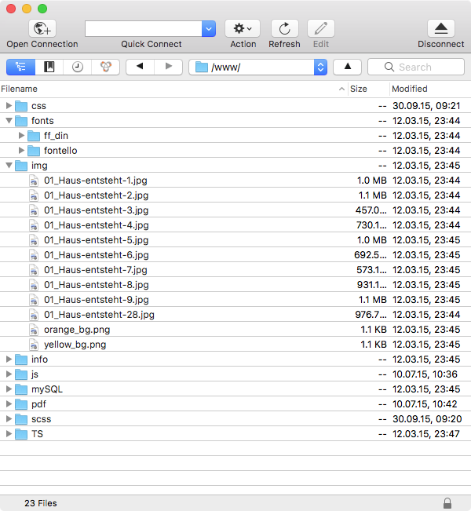

# Technologie · Services & Server

::: TOC
**Content**
[[TOC]]
:::

## Kommunikation zum Webserver

In den meisten Fällen überträgt der Webserver Daten zum Browser, also Besucher. Jedoch ist bereits das Abfrage einer Website auch für den Webserver eine Datenübermittlung. Auch wenn diese Information nur klein ist – nämlich der gewünschte URL – so ist diese Information doch eintscheidend für die Verarbeitung auf dem Server. Nur mit dieser Angabe kann die korrekte Datei geliefert werden.

### GET-Anfrage
Ein GET-Befehl vom Browser an den Server fordert die angegebene Ressource an. Der Server bekommt die Adresse vom Browser als Information. Darüber hinaus kann der Browser über den Header-Request Informationen zur Fähigkeit des Browsers übermitteln oder weitere Anfrage-Parameter übergeben. GET-Befehle sind die meist verbreiteten Aufrufe beim täglichen Browsen.

::: grid fullsize space3

:::

### Werte über URL übergeben
Über die URL können Werte mit gegeben werden.
Werte folgen nach dem Seiten-URL abgetrennt mit einem Fragezeichen (?). Mehrere Werte können über ein At-Zeichen (&) übergeben werden.

#### Beispiel
::: code
<pre>
http://domain.com/seite.html?name=wert&name2=wert2
</pre>
:::
 

Übergebene Werte an Server:
::: code
<pre>
name: wert  
name2: wert2  
</pre>
:::

### POST-Anfrage
Eine Post-Anfrage dient dem Server nicht nur als Anfrage, sondern mit der Anfrage können gleichzeitig grössere Mengen an Daten übergeben werden. Diese Methode kommt meist dann zum Einsatz, wenn der Benutzer gezielt Informationen eingibt oder hochladen möchte. So sind zum Beispiel Formulare meist mit POST-Anfragen gemacht. Bei einer POST-Anfrage wird die Information der Adresse (URL) übergeben und gleichzeitig werden die Daten mit versendet.

::: grid fullsize space3

:::

### PUT, DELETE, ...
Neben GET und POST gibt es noch diverse andere Anfrage-Typen, die von einem Browser abgesetzt werden können. Diese sind jedoch nicht sehr gebräuchlich und werden meist nur für web-basierte Applikationen eingesetzt.

### REST & GraphQL
REST steht für «Representational State Transfer». Die Idee für RESTful Web Services wurde im Jahr 2000 durch Roy Fielding im Rahmen seiner Dissertation entwickelt. Er beschreibt vereinfacht gesagt, dass nicht mehr ganze HTML-Seiten vom Server zum Browser gesendet werden, sondern nun noch mit GET-, POST-, PUT- und DELETE-Anfragen Daten zum Server gesendet und erfragt werden. Also nur die Daten, nicht aber die Repräsentation (Darstellungsform).

Im Jahr 2015 hat Facebook GraphQL publiziert (seit 2012 in Entwicklung). Dabei handelt es sich um eine weitaus flexieblere Abfrage-Sprache, wie von einem Server informationen erfragt werden können. Auch sind darin bereits vorgesehen, dass man sich an Informationen «abonnieren» kann um Updates vom Server zu erhalten.

## FTP Transfer
::: margin compact
#### FTP
Das File Transfer Protocol (FTP, englisch für Dateiübertragungsprotokoll) ist ein 1985 spezifiziertes Netzwerkprotokoll zur Übertragung von Dateien über IP-Netzwerke. Es wird benutzt, um Dateien vom Server zum Client (Herunterladen), vom Client zum Server (Hochladen) oder clientgesteuert zwischen zwei FTP-Servern zu übertragen.

Quelle:
https://de.wikipedia.org/wiki/&shy;File_Transfer_Protocol
:::
Um Dateien auf einen (Web-)Server zu übertragen gibt es diverse Möglichkeiten. Eines der beliebtesten und einfachsten Verfahren ist es, sich mit einem FTP-Client an den Server anzumelden und die Daten mit diesem Programm zum Server zu übermitteln.

### Sicherheit bei FTP-Verbindungen
Zu beachten ist, dass das Passwort bei der Verbinung zu einem FTP-Server im Klartext übermittelt wird und somit von anderen Teilnehmern im selben Netzwerk mitgehört werden kann. Deshalb ist es empfehlenswert FTP über SSL (FTPS) zu verwenden oder  SSH File Transfer Protocol (SFTP) zu benutzen um die Kommunikation zu verschlüsseln und das Passwort geheim zu behalten. Alle modernen FTP-Clients bieten diese Optionen, jedoch nicht alle Server unterstützen auch gesicherte Verbindungen.

::::: grid fullsize space3
:::: col_4of12
::: imageline

:::
### Up- & Download
Der Fortschritt über Up- und Downloads wird meist separat angezeigt. Es können auch mehrere Verbindungen gleichzeitig zum Server aufgebaut werder um schnellere Übertragungen zu erreichen.

::::
:::: col_8of12_last

::: imageline upscale

:::
### Dateien & Ordner
Ein FTP-Programm zeigt den Inhalt eines Server in einer Struktur mit Ordnern und Dateien an.

::::
:::::

## Servertechnologien und Datenbanken
::: margin compact
### Relationale Datenbank
Eine relationale Datenbank dient zur elektronischen Datenverwaltung in Computersystemen und beruht auf einem tabellenbasierten relationalen Datenbankmodell.

### SQL
SQL ist eine Datenbanksprache zur Definition von Datenstrukturen in relationalen Datenbanken sowie zum Bearbeiten (Einfügen, Verändern, Löschen) und Abfragen von darauf basierenden Datenbeständen.

Quellen:
* https://de.wikipedia.org/wiki/&shy;Relationale_Datenbank
* https://de.wikipedia.org/wiki/SQL

:::
Auf einem Server können nicht nur statische Daten liegen, die dann an einen Browser ausgeliefert werden, sondern es können auch Programme (oft Skripte) auf dem Server liegen, die dann durch einen Aufruf vom Server ausgeführt werden. Somit kann auf verschiedene Verhalten oder Bedürfnisse vom Benutzer eingeganen werden.

#### PHP – Skriptsprache
Eine der am häufigsten verbreiteten Server-Technologien ist PHP	(Backronym für «PHP: Hypertext Preprocessor»). Diese Skriptsprache läuft auf fast allen Webservern, die für wenig Geld angemietet werden können. Auch sind sehr viele Blog-Systeme und CMS mit PHP programmiert. Durch das Alter (1995 erste Version) und diverse Fehlentscheide gilt die Sprache nicht mehr als besonders modern, kann aber in neuen Version durchaus gekonnt eingesetzt werden. Oft ist der Ruf von PHP schlecht, weil die Sprache von Anfängern zweifelhaft verwendet wird.

#### Node/Ruby/Python
Neben PHP gibt es auch diverse andere Technologien, die eine Ausführung von Programmen (Skripte) auf dem Web-Server ermöglichen. Je nach Technologie gibt es Vor- oder Nachteile, die jedoch eher Marginal sind. Oft ist der Technologie-Entscheid durch Server-Vorgaben oder System-Vorgaben gegeben. Oder aber auch die Fähigkeit des Technikers kann den Entscheid beeinflussen.

#### Datenbank-Zugriffe
Server-Technologien sind nicht zuletzt wegen der Anbindung an Datenbanken verbreitet. So können Daten wie in einer Excel-Tabelle in strukturierter Form abgelegt werden und gezielt wieder abgefragt werden. Um auf die Datenbank Zugriff zu gewähren, werden mit Server-Skripts Interfaces geschrieben, die dann die Daten an den Browser liefern. Nebst typischen Datenbank-Anwendungen wie Adressdatenbanken sind aber auch heute die meisten Inhalte von Websites in Datenbanken abgelegt um ein einfacheres technisches Handling zu erreichen und benötigte Inhalte schneller zu durchsuchen.

::: margin printonly
#### Autor
Stefan Huber  
sh@signalwerk.ch  
+41 78 744 37 38

#### Dokumentgeschichte
September 2015: Erstellung  
März 2017: Erweiterung

:::

## Weiterführende Informationen

### REST – GET – POST – GraphQL
* https://de.wikipedia.org/wiki/Representational_State_Transfer
* https://en.wikipedia.org/wiki/Hypertext_Transfer_Protocol&shy;#Request_methods
* http://graphql.org/

### REST-Applikation (Beispiel)
* http://discuss.emberjs.com/

### FTP-Programme
* https://cyberduck.io/ (frei)
* https://panic.com/transmit/

### Servertechnologien
* http://www.php.net/
* https://nodejs.org/
* http://rubyonrails.org/

### Relationale Datenbanken
* https://mariadb.org/ (freies MySQL)
* https://www.sqlite.org/ (frei)
