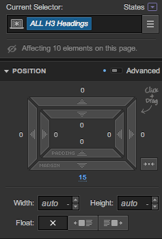
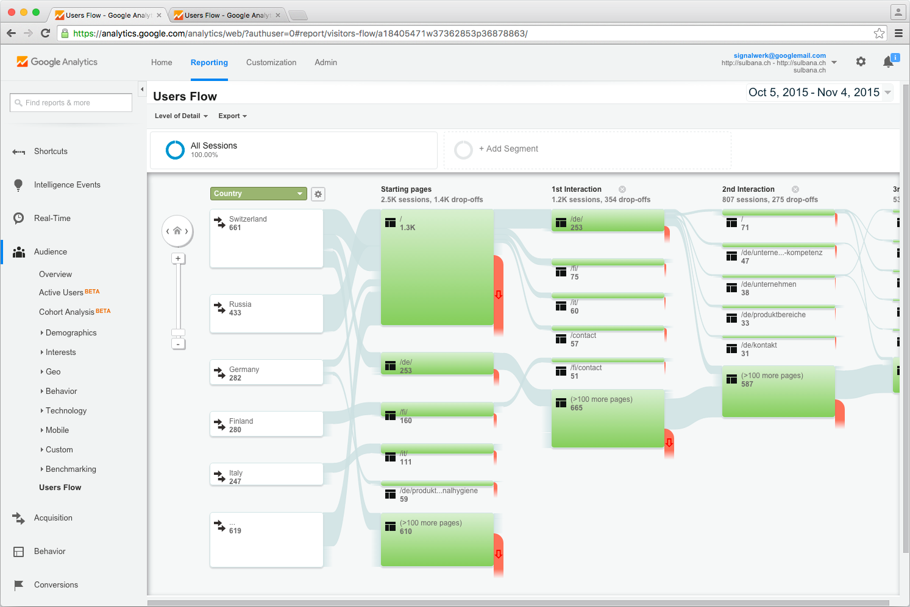

# Redaktions- und Autoren-Tools (CMS)

::: TOC
**Content**
[[TOC]]
:::

## HTML-Editoren
Bei HTML-Editoren handelt es sich um Programme, die meist lokal installiert werden und die dann eine visuelle Editierung von HTML-Seiten ermöglichen. Dabei gibt es meist auch die Möglichkeit von Hand zusätzlich in den Code ein zu greifen. Mit solchen Editoren lassen sich einfache Seiten erstellen oder aber Vorlagen realisieren, die später für eine Websystem (CMS) verwendet werden können. Meist ist die Komplexität für eine grössere Website mit solch einem Editor unüberschaubar und es müssen weitere Programme eingesetzt werden.

### Bekannte Editoren:

* [Adobe Edge Animate](https://www.adobe.com/products/edge-animate.html)
* [Adobe Muse](http://muse.adobe.com/)
* [Adobe Dreamweaver](http://www.adobe.com/products/dreamweaver.html)
* [Google Web Designer](https://www.google.com/webdesigner/)

 
 

::::: grid fullsize
:::: col_6of12

::::

:::: col_6of12_last

::::
:::::

::::: grid fullsize
:::: col_6of12

Dreamweaver von Adobe wird seit Jahren weiter entwickelt.
Es gibt diverse Funktionalitäten, die jedoch meist eher traditionelle Design-Prinzipien unterstützen.
::::

:::: col_6of12_last
Programme wie Google Web Designer eignen sich eher für pixelgenaue Layouts, wie sie zum Beispiel für Banner gebraucht werden.
::::
:::::

## Content Management System (CMS)
::: margin compact
### WordPress
WordPress ist eine freie Software zur Verwaltung der Inhalte einer Website. Sie bietet sich besonders zum Aufbau und
zur Pflege eines Weblogs an, da sie jeden Beitrag einer oder mehreren frei erstellbaren Kategorien zuweisen kann und dazu automatisch die entsprechenden Navigationselemente erzeugt.
Quelle: [wikipedia](http://de.wikipedia.org/wiki/WordPress)
:::
Ein Content Management System dient zur Verwaltung von Websites und zum betreuen von Inhalten auf einer Seite. Das System versucht möglichst die Technologie vor dem Benutzer zu verbergen und ermöglicht es auch Laien, ein schnelles und einfaches Editieren von Websites zugänglich zu machen.
Das CMS wird meist von einem Programmierer installiert, kann aber später von einem Laien angewendet werden. Weltweit gesehen ist WordPress das wohl am häufigsten verwendete CMS. Andere verbreitete CMS sind:

* WordPress – Blogging und Websites
* Magento – Shop-System
* Ghost – Blogging
* Drupal – Websites
* Typo3 – Websites
* Neos – Websites
* Indexhibit – Portfolios

### Einflussmöglichkeiten
::: margin
### Klassische CMS
* Wird auf dem eigenen Server installiert.
* Haben meist eine Datenbank um die Daten darin zu halten.
* Laufen oft auf Servern, die PHP (Skript-Sprache) ausführen können.
* Haben ein UI, welches von Leihen bedient werden kann.
:::
Bei einem klassischen CMS wird, wie der Name dies schon andeutet, vorwiegend auf Inhaltlicher Ebene gearbeitet. Dies heisst, dass der Autor oder der Gestalter zumeist vorher definierte Designs mit neu generierten Inhalten verknüpft.

### Seitenstruktur
Die Seiten werden oftmals in Seitenbäume gegliedert. Somit kann der Autor neue Seiten oder Sammlungen von Inhalten erstellen. Auch können hier einzelne Teile ein- und ausgeblendet werden.

 
 

::::: grid fullsize
:::: col_4of12
::: imageline

:::
::::

:::: col_8of12_last
::: imageline

:::
::::
:::::

::::: grid fullsize
:::: col_4of12
Seitenstruktur mit Hierarchie
::::

:::: col_8of12_last

Je nad System werden Seiten auch über andere Eingaben generiert.
Hier zum Beispiel über eingabe von Produkten.
::::
:::::

## Medienneutrale Daten
Von medienneutralen Daten spricht man meist dann, wenn man den Vorliegenden Inhalt in verschiedenen Medien (Cross Media Publishing, Multi Channel Publishing) gebrauchen möchte. Doch auch bei einer Website ist es wichtig, dass die Inhalte so aufbereitet sind, dass diese später auch für andere technische Voraussetzungen wieder verwendet werden können. So kann über die Jahre das Layout der Website ändern, oder die Bildschirme benötigen, durch die immer höher werdenden Auflösungen, grössere Bilder.

### JPG/PNG/TIFF/PDF – Was ist das richtige?
Grundsätzlich ist immer das Dateiformat, welches die wenigsten Kompromisse punkto inhaltlicher Wiedergabe ermöglich, zu bevorzugen. Das heisst, dass ein Bild ohne Kompression oder mit verlustfreier Kompression einem Bild mit verlustbehafteter Kompression zu bevorzugen ist. Auch sollten – wo vorhanden – Vektor-Daten eingesetzt werden und nicht Pixelbilder davon erstellt werden müssen.
Die Ausgabe für den Browser ist meist mit Pixel-Daten, die eine verlustbehaftete Kompression besitzen. Jedoch kann dann jederzeit genau gesteuert werden, wie stark eine Kompression sein soll und welches Dateiformat für die Ausgabe (JPG/PNG/GIF) verwendet werden kann. Zum Teil ist es aufgrund der eingesetzten Server-Technologie nicht möglich Vektor-Formate (wie zum Beispiel in PDF) zu verarbeiten. Dies ist jedoch mit einem Techniker zu klären.

### Farbprofile
Grundsätzlich sollte in jeder Medienproduktion ein Bild (oder Video) in den Metadaten Informationen enthalten, wie die Farben profiliert wurden. Für Bilder geschieht dies heute meist über ein ICC-Farbprofiel (International Color Consortium). Bei der Verwendung von Bildern im Web wird an den Browser meist eine Bilddatei übergeben, die kein Farbprofil enthält, da man die Übertragungszeit möglichst klein halten möchte und somit diese Informationen nicht mit schickt. Da die Information fehlt, wird in den meisten Fällen davon ausgegangen, dass das Bild sRGB (oder ähnlich) kodiert ist. Somit muss auf dem Server eine Farbkonvertierung vom ursprünglichen Farbraum, welcher als ICC vorliegt, zum Zielfarbraum sRGB konvertiert werden. Dieser Vorgang ist nicht auf allen Servern möglich.

### UTF-8 und Plain HTML
Texte sollten immer in UTF-8 kodiert werden. Dies ermöglich die Eingabe von insgesamt 1112064 verschiedenen Zeichen, welche somit fast alle erdenkbaren Sprachen und Anwendungsfälle abdecken.
Zudem sollte, wo immer möglich, das Layout und die Formatierung des Textes nicht mit speziell eingefügten HTML-Tags (wie span oder div) oder unnötigen Klassen erfolgen, sondern mit den Standard-­HTML-Tags gelöst werden. Dies ermöglicht die Verwendung des selben Textes auch nach einer Umstellung des Layouts.

## Web-Editoren
::: margin compact
### squarespace.com
Suarespace ist eine webbasiertes Content Management System (CMS), das einen Homepage-Baukasten bietet um einfache Websites oder Blogs zu erstellen und zu hosten. Der Service ermöglicht es ohne Vorkentnisse eine Website zu erstellen.
Squarespace ist in diesem Markt (Software as a service) wohl der Weltführer.

Weitere grosse Anbieter:
* [WiX](http://www.wix.com/)
* [Jimdo](http://www.jimdo.com/)
* [weebly](http://www.weebly.com/)
:::
Seit einigen Jahren gibt es Web-Dienste, mit denen man im Browser Webseiten gestalten und bearbeiten kann. Diese Editoren weisen meist einen sehr webgerechten Zugang zur Gestaltung auf und die dort realisierten Layouts sind meist eine hervorragende Vorlage um später von einem Programmierer weiter bearbeitet zu werden, oder aber bieten auch die Funktion, die ganze Seite zu erstellen und zu publizieren.
Es gibt diverse Anbieter und viele verschiedene Services. Die meisten können in einem Grundpacket ohne Bezahlung benutzt werden und stellen dazu einen bezahlten Hosting-Service zur Verfügung. Je nach Anbieter kann Funktionalität und Schwerpunkt sehr stark variieren.

 
 
 
 
 

::::: grid fullsize
:::: col_6of12

::::

:::: col_6of12_last

::::
:::::

::::: grid fullsize
:::: col_6of12
webflow.com bietet eine sehr umfangreiche Möglichkeit, Inhalte und Darstellung zu editieren.
::::

:::: col_6of12_last
typecast.com hat den Fokus sehr stark auf Typografie
und Schrift im Web gelegt.
::::
:::::

 
 

::::: grid fullsize
:::: col_6of12
::: w60p

:::
::::

:::: col_6of12_last
::: w60p

:::
::::
:::::

::::: grid fullsize
:::: col_6of12
Sprachgebrauch und Technologie richtet sich sehr stark an HTML 5.
::::

:::: col_6of12_last
Die Oberfläche von typecast.com ermöglicht schnell eine visuelle Einstellung von typografischen Feinheiten.
::::
:::::

## Statistiken und Auswertung
Um die Benutzung der eigenen Website zu analysieren, kann in vielen Web-Editoren oder beim Setup auch ein so genanntes Tracking eingerichtet werden. Dieses Analysiert nicht nur mit was für Geräten und Browsern die Website Besucht wird, sondern es ermöglicht auch die Besucherströme zu analysieren und daraus Rückschlüsse über allfällige Korrekturen zu ziehen. Auch die geografische Lokalisation des Besuchers kann helfen um zu verstehen, in welchen Märkten und bei welchem Publikum das Interesse am grössten ist.

### Privacy
Es gibt für das Tracken von Benutzern Anbieter, die sich darauf spezialisiert haben dem Website-Betreiber eine möglichst einfache Analyse dieser Daten zu ermöglichen. Man muss sich dabei jedoch bewusst sein, dass der Anbieter dadurch selber ein tiefes Verständnis über die Besucher erhält, was unter Umständen nicht gewünscht ist.
Auch gibt es gewisse Leute, die sich gezielt gegen solches Tracking schützen und in den Browsern Extensions installieren um solche Dienste dann auszuschalten.

 
 

::::: grid fullsize
:::: col_4of12

Schwankungen und Entwicklungen bei den Besucherzahlen können über längere Zeiträume analysiert werden.

 
 

Technologische Entscheide können aufgrund von Browser- und Geräte-Statistiken fundiert begründet werden..

::::

:::: col_8of12_last

Besucherströme können durch eine Analyse auch verraten,
wo es allenfalls Verbesserungspotential gibt.
::::
:::::

::: margin printonly
#### Autor
Stefan Huber  
sh@signalwerk.ch  
+41 78 744 37 38

#### Dokumentgeschichte
Juni 2014: Erstellung
November 2015: Erweiterung  
Mai 2017: Erweiterung

:::

## Weiterführende Informationen

### Content Management System
* http://wordpress.org/
* https://www.drupal.org/
* http://typo3.org/
* http://www.indexhibit.org/

### HTML-Editoren
* https://creative.adobe.com/products/animate
* http://www.adobe.com/products/dreamweaver.html
* https://creative.adobe.com/products/code
* https://creative.adobe.com/products/reflow
* http://www.google.ch/webdesigner/

### Web-Editoren
* https://webflow.com
* http://www.squarespace.com/
* http://www.shopify.com/
* http://www.webydo.com/

### Medienneutral
* https://de.wikipedia.org/wiki/ICC-Profil
* http://www.pagina-online.de/xml-hintergruende/pagina-das-kompendium/themenkomplex-i-cross-media/ohne-sie-geht-nichts-medienneutrale-daten/

### Statistik
* http://piwik.org/
* https://analytics.google.com/
